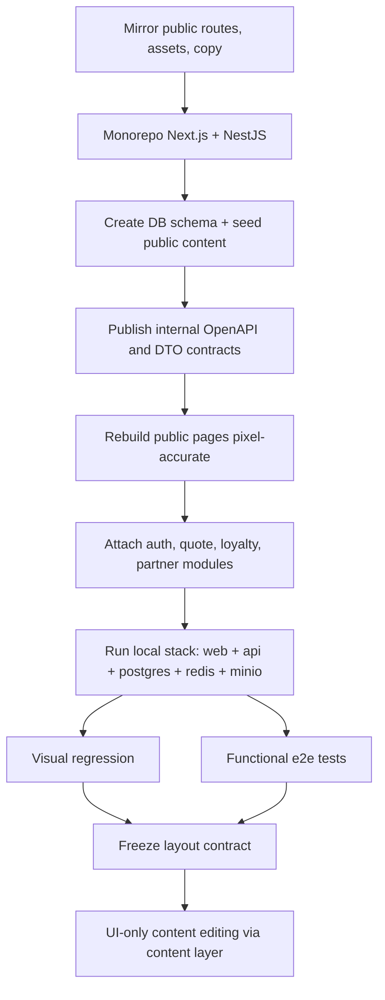

# Báo cáo phân tích và kế hoạch clone cục bộ website JETBAY

## Tóm tắt điều hành

JETBAY là một nền tảng đặt thuê chuyến tư nhân toàn cầu, định vị như một “OTA-style private jet booking platform”, có lớp public marketing rất lớn, lớp giao dịch đặt chuyến/quote phong phú, lớp tài khoản đăng nhập, các chương trình loyalty và membership, cùng một lớp dashboard đối tác tùy biến với các năng lực như back-end account, smart ordering, multi-language quotation, real-time flight operations updates, client management & signing system. Phần public đã quan sát được bao phủ nhiều nhóm chức năng: on-demand charter, fixed-price routes, empty legs, group/corporate/event/pet/air ambulance charter, Jet Card, Travel Credits, Partner Program, app landing page, destination/editorial hubs, video centre, legal pages và nhiều landing page chiến dịch theo quốc gia/ngôn ngữ. citeturn14view0turn20view0turn17view2turn17view0turn15view0turn14view5turn17view1turn17view5turn21view0turn14view6turn21view1turn27view0turn11search0turn29search3turn38search7

Về yêu cầu “confirm Next.js frontend, NestJS backend, Swagger docs presence”: với phạm vi public web, tôi **xác nhận được** sự tồn tại của hệ tài khoản, xác thực bên thứ ba, custom dashboard/back-end account, AI-driven matching, workflow ký charter agreement, và các bề mặt nghiệp vụ đủ sâu để suy ra một backend dịch vụ riêng; nhưng tôi **không tìm thấy bằng chứng công khai đủ mạnh để xác nhận dứt khoát** website hiện chạy Next.js, backend hiện chạy NestJS, hoặc đang public Swagger/OpenAPI. Vì vậy, phần kiến trúc FE/BE và API dưới đây được chia rõ thành hai lớp: **điều quan sát được** và **bản tái dựng clean-room có xác suất cao** để clone local 100% về layout/chức năng công khai, trong khi chỉ thay đổi nội dung UI. citeturn29search3turn40view1turn27view0turn39view0turn30view0turn30view1

Kết luận vận hành: nếu không có repo và credentials riêng, con đường khả thi nhất là **clean-room reconstruction** theo monorepo FE/BE mới, giữ nguyên cấu trúc route, DOM, spacing, trạng thái tương tác và business flows quan sát được; đồng thời đưa toàn bộ copy/text/image/video vào một content layer riêng để “UI-only edits” không ảnh hưởng layout hay hành vi. Với cách này, có thể tái tạo gần như đầy đủ phần public site và các flow account-facing có thể suy luận từ terms, policy và public pages; riêng các endpoint nội bộ, dashboard sau đăng nhập và logic pricing/ops thật sự sẽ phải được dựng lại theo hợp đồng API đề xuất trong báo cáo này. citeturn39view0turn34view0turn36view0turn37view0turn29search3

## Phạm vi khảo sát và mức độ chắc chắn

Phạm vi khảo sát gồm các route public và legal quan trọng đã crawl trực tiếp: trang chủ global và locale, private-jet-charter, booking-process, fixed-price-charter, empty-leg, group-air-charter, corporate-air-charter, event-air-charter, pet-travel, air-ambulance, jet-card, travel-credit, global-partnership-program, about-us, destination, island-destinations, video-centre, news, blogs, world-cup booking pages, app landing page, privacy policy, cookie notice, Jet Card terms, Travel Credits terms; ngoài ra còn ghi nhận các template slug động như `/news/:slug`, `/blogs/:slug`, `/empty-leg-recommendation/:slug`, `/fixed-price-charter/:route-slug`, và các locale như `/en-us`, `/en-ca`, `/en-ae`, `/en-id`, `/zh-cn`, `/zh-hk`, `/zh-tw`. citeturn14view0turn20view0turn39view0turn17view2turn8view0turn23search2turn22search13turn14view4turn16view2turn17view0turn15view0turn14view5turn17view1turn17view4turn21view0turn17view3turn17view5turn14view6turn21view1turn34view0turn32view0turn11search0turn27view0turn36view1turn36view0turn30view1turn30view0turn26search3

Để tránh trộn lẫn giữa “thấy tận mắt” và “suy luận”, tôi dùng ba mức độ chắc chắn sau. **Cao** áp dụng cho route, form field, CTA, legal rule, partner feature matrix, payment method, login providers, cookie categories, loyalty rules, Jet Card rules. **Trung bình** áp dụng cho existence của dashboard custom, account model cá nhân/công ty, itinerary multi-leg, inventory phản hồi thời gian thực, AI-driven matching, secure signing, saved searches. **Thấp–trung bình** áp dụng cho stack framework cụ thể, endpoint nội bộ, mã lỗi chính xác, sơ đồ module FE/BE và database nội bộ — các phần này được thiết kế lại từ public evidence chứ không phải trích xuất trực tiếp từ source/private repo. citeturn24view4turn24view5turn40view1turn27view0turn36view0turn37view0turn34view0turn39view0turn33search10

Điểm quan trọng nhất về giới hạn là: phần public cho thấy rất rõ **có account system**, **có secure login**, **có partner back-end account**, **có balance/remaining hours cho Jet Card**, **có company authorization cho Travel Credits**, nhưng không public route màn hình đăng nhập, route dashboard hay network endpoints đằng sau chúng. Vì vậy, báo cáo này cố tình không “bịa xác nhận” Next.js/NestJS/Swagger; thay vào đó, tôi đưa ra bản clone local mang tính triển khai được ngay, với mọi chỗ còn khuyết đều gắn nhãn “đề xuất tái dựng” hoặc “chưa xác nhận công khai”. citeturn42search0turn42search1turn42search3turn29search1turn29search3turn36view0

## Sơ đồ chức năng và luồng người dùng

Cây chức năng public và semi-authenticated quan sát được có thể tổng hợp như sau:

```text
JETBAY
├─ Public marketing
│  ├─ Home global và locale
│  ├─ About us / office contacts
│  ├─ Booking process
│  ├─ Private jet charter
│  ├─ Fixed-price charter
│  │  ├─ Index routes
│  │  └─ Route detail pages
│  ├─ Empty legs
│  │  ├─ Index
│  │  └─ Recommendation/detail pages
│  ├─ Group air charter
│  ├─ Corporate air charter
│  ├─ Event air charter
│  ├─ Pet travel
│  ├─ Air ambulance / medevac
│  ├─ Jet Card
│  ├─ Travel Credits
│  ├─ Global Partnership Program
│  ├─ App landing page
│  ├─ Destination hub
│  ├─ Island destinations
│  ├─ Video centre
│  ├─ News hub
│  │  └─ News detail pages
│  ├─ Blogs hub
│  │  └─ Blog detail pages
│  └─ Campaign landing pages
│     ├─ World Cup route builder
│     └─ World Cup final / special offers
├─ Legal
│  ├─ Privacy policy
│  ├─ Cookie notice
│  ├─ Jet Card terms
│  └─ Travel Credits terms
├─ Account-facing features
│  ├─ Login / register
│  ├─ Apple Sign In / Google Sign In / email credential auth
│  ├─ Saved searches
│  ├─ Travel Credits account
│  ├─ Jet Card balance / remaining hours
│  └─ Partner back-end account
└─ Partner layer
   ├─ Partner application
   ├─ Role matrix
   ├─ Smart ordering & multi-language quotation
   ├─ Flight ops updates
   ├─ Brand asset library
   ├─ Visualized process
   ├─ Supplier contract
   └─ Client management & signing system
```

Cây trên được tổng hợp từ toàn bộ route public đã quan sát trực tiếp, terms/policy, và các landing slug động đã index công khai. citeturn14view0turn17view4turn39view0turn20view0turn17view2turn8view0turn23search2turn22search13turn14view4turn16view2turn17view0turn15view0turn14view5turn17view1turn32view0turn21view0turn17view3turn17view5turn14view6turn21view1turn34view0turn42search9turn11search0turn27view0turn36view1turn36view0turn40view1turn29search0turn29search1turn29search3

Bảng dưới đây là **functional sitemap** ở mức route/template và chức năng kèm theo:

| Nhóm | Route hoặc template | Chức năng quan sát được | Thành phần/interaction chính | Nguồn |
|---|---|---|---|---|
| Home | `/`, `/en-us` và locale | Hero quote/search, promo campaigns, medical CTA, about/why choose, social/media trust blocks | Tab One Way / Round-Trip / Multi-City, From/To, calendar, passenger stepper, Search Available Aircraft, promo banners | citeturn14view0turn42search2 |
| Quote guide | `/booking-process` | Mô tả end-to-end booking | 4 bước enquiry → quotation → confirmation & payment → fly; secure signing; payment methods | citeturn39view0turn42search5 |
| Core charter | `/private-jet-charter` | Search aircraft, service discovery, promo cross-sell | Search widget, service cards, aircraft comparison cards, Jet Card / Travel Credit CTAs | citeturn20view0turn20view1turn20view2turn20view3 |
| Fixed price index | `/fixed-price-charter` | Hiển thị route fixed-price theo khu vực | Route cards, Light vs Midsize/Heavy categories, Book Now, FAQ, Show More | citeturn17view2turn16view4turn42search8 |
| Fixed price detail | `/fixed-price-charter/:slug` | Route detail, fixed pricing, airport/flight info, booking detail | FAQ, “what’s not included”, Book Now | citeturn42search7 |
| Empty legs index | `/empty-leg` | Real-time empty-leg listing | Destination/date filters suy ra từ page, route cards, Book Now, FAQ | citeturn9view4turn13search5turn19search9 |
| Empty leg detail | `/empty-leg-recommendation/:slug` | Editorial + booking CTA cho route empty-leg | Share, article content, aircraft recommendations, contact CTA | citeturn21view4turn38search9 |
| Group charter | `/group-air-charter` | Nội dung dịch vụ nhóm, nhiều use case | Expand/collapse “View More”, service cards | citeturn23search2turn14view3 |
| Corporate charter | `/corporate-air-charter` | Business/MICE/delegation/personnel logistics | More CTAs, service cards chuyên biệt | citeturn23search1turn33search5 |
| Event charter | `/event-air-charter` | Corporate events, weddings, parties, concerts, film, sports | More cards theo ngành/sự kiện | citeturn14view4turn23search0turn33search1 |
| Pet travel | `/pet-travel` | Search aircraft + pet-specific value props | Search widget, intro expandable block, explainer section | citeturn16view2turn23search4 |
| Air ambulance | `/air-ambulance` | Search aircraft + medevac service | Search widget, expand intro, medical equipment matrix, promo cross-sell | citeturn17view0turn16view3turn23search6 |
| Jet Card | `/jet-card` | Membership landing, tier comparison, enquiry form, FAQ | Plan cards, comparison table, aircraft model carousel, balance FAQ, enquiry form | citeturn15view0turn16view0turn29search1 |
| Travel Credits | `/travel-credit` | Loyalty programme landing | Eligibility text, accrual/redemption messaging, T&C deep-link | citeturn14view5turn22search10turn42search6 |
| Partner program | `/global-partnership-program` | Role matrix, application process, application form | Role tabs, compare matrix, apply CTA, form, verification SLA 3 working days | citeturn17view1turn20view4turn24view4turn24view5turn29search3 |
| About | `/about-us` | Company story, awards, contacts, office list | Contact cards, office map link | citeturn17view4turn28view0 |
| Destination hub | `/destination` | Regional tabs, currently sparse content | Region tabs, Coming Soon state | citeturn21view0 |
| Island destinations | `/island-destinations` | Travel showcase grid | Destination cards, Explore More | citeturn17view3 |
| Video centre | `/video-centre` | Video listing hub | Featured/Newest, cards with duration and views | citeturn17view5 |
| News hub | `/news` | Latest business/general aviation editorial list | News cards linking to detail pages | citeturn14view6 |
| Blogs hub | `/blogs` | Editorial categories hub | Categories: Private Jet Guide, Events & Activities, JETBAY Highlights, Client Stories | citeturn21view1 |
| Campaign | `/world-cup-2026-private-jet-booking` và locale | Match calendar + route builder multi-leg | Stage/country filter, calendar, route legs, add leg, contact info, request quote | citeturn34view0turn35search4 |
| Campaign | `/world-cup-final-2026-private-jet-charter` và locale | Final-specific fixed packages | Route cards, prices, Book Now | citeturn42search9 |
| App landing | `/jetbay-private-jet-app` | App distribution và feature showcase | App Store CTA, QR code, app previews | citeturn32view0turn19search0 |
| Legal | `/article/policy`, `/article/cookie`, `/article/travel-card`, `/article/travel-credit` | Privacy/cookie/loyalty/membership rules | Footer legal links, policy content, governance and eligibility rules | citeturn11search0turn27view0turn36view1turn36view0 |

Các **global UI components** và phần tử tương tác lặp lại trên nhiều trang gồm: header với Menu, logo, Contact Us, locale/currency selector và Log In; footer với newsletter subscription, payment badges, association badges, social links; search widget với trip-type tabs, airport fields, date picker, passenger stepper; accordion FAQ; “Show More”/“View More”; share button trên article pages; promo cards; compare tables; world-cup route builder có “Add another flight leg”; cookie banner/settings center có Accept All hoặc Submit Preference cho Analytics/Marketing; và form consent chấp thuận Privacy Policy trước khi gửi yêu cầu. citeturn20view0turn17view2turn16view2turn17view0turn34view0turn27view0turn16view0turn21view4

Các **forms và mô hình dữ liệu đầu vào** quan sát trực tiếp gồm:  
- **Search Available Aircraft**: trip type, from, to, departure local date, passengers. Xuất hiện trên home và nhiều service pages. citeturn14view0turn20view0turn16view2turn17view0turn39view0  
- **Jet Card enquiry**: first name, last name, email, phone number, country code, message, consent checkbox, privacy acknowledgment. citeturn16view0  
- **Partner application lead form**: partner type tab, email, phone number, country code, WhatsApp, WeChat. Quy trình yêu cầu tạo account trước rồi submit application. citeturn24view0turn24view5  
- **World Cup quote builder**: related match, departure city, arrival city, departure local date, passengers, add another leg, contact information, country code, message, consent checkbox. citeturn34view0  
- **Newsletter subscription**: field không hiện rõ trong parser nhưng CTA “Subscribe” xuất hiện nhất quán toàn site. citeturn17view4turn27view0

Về **user roles và quyền hạn**, các role có bằng chứng rõ nhất là: anonymous visitor; direct retail customer; individual account; company account; authorised employee trên company account; Jet Card customer; partner applicant; Service Partner; Referral Partner; Official Partner. Individual và company account có rule accrual/redeem Travel Credits khác nhau; Jet Card có manager-assisted booking và tracking remaining balance; partner roles có ma trận quyền truy cập vào support, ops updates, smart ordering, training, back-end account, brand asset library, visualized process, supplier contract, client management & signing system. Do parser không render checkmark/empty-state trong matrix, sự khác nhau chính xác giữa từng partner tier chỉ xác nhận được ở mức “có matrix phân quyền”, không xác nhận được 100% mọi ô quyền. citeturn36view0turn37view0turn29search1turn24view4turn29search3

Về **third-party integrations**, bằng chứng công khai cho thấy JETBAY dùng Google Analytics và các Advertising Features như Google Signals, Ads Personalisation, Cross Platform Reporting, Remarketing, Demographics and Interests; hỗ trợ Apple Sign In, Google Sign In và email credentials; mobile app xin quyền Location và Contacts; app analytics/crash reporting có thể dùng Firebase hoặc dịch vụ tương tự; có outbound links tới App Store, Google Maps, Facebook cùng nhiều social networks khác; website/app dùng third-party analytics cookies, advertising cookies/pixels và mobile SDKs; và asset hình ảnh public được phục vụ từ `asserts.jet-bay.com`. citeturn41view0turn40view1turn40view3turn40view5turn32view0turn28view0turn27view0turn15view3

## Phân tích kiến trúc kỹ thuật

Điều có thể khẳng định từ public evidence là JETBAY không phải một brochure site đơn giản. Nó kết hợp ít nhất bốn lớp: **content marketing đa locale**, **transactional quote/booking layer**, **account/auth layer**, và **partner/loyalty/membership layer**. Bằng chứng là sự hiện diện đồng thời của quote search widgets lặp trên nhiều vertical pages; world-cup multi-leg builder; secure signing và payment stage trong booking process; Travel Credits với logic accrual/redemption theo account type; Jet Card với tracking remaining balance; và partner matrix mô tả back-end account cùng signing system riêng. citeturn39view0turn34view0turn36view0turn37view0turn29search1turn29search3

Về mặt ứng dụng, site thể hiện mô hình **CMS + application hybrid**: phần article/news/blogs/video/destination là content-driven; trong khi search widget, fixed-price route cards, empty-leg listings, Jet Card/Partner forms và World Cup route builder là application-driven. Ngoài ra, nội dung tiếng Anh và tiếng Hoa trên about page còn nêu rõ họ có **AI team nắm cơ sở dữ liệu vận hành business jet toàn cầu**, và **development team xây dựng một AI platform tích hợp sâu với database/big data** để tối ưu matching và giảm empty legs. Đây là bằng chứng mạnh rằng phía sau public site có nền tảng dữ liệu/ops riêng, không chỉ là CMS marketing. citeturn14view6turn21view1turn17view5turn17view2turn8view0turn30view0turn30view1

Bảng dưới đây tách rõ **điều đã quan sát** và **điều chưa thể xác nhận công khai**:

| Chủ đề | Bằng chứng công khai | Kết luận |
|---|---|---|
| Frontend framework cụ thể | Locale route prefixes, page templates lặp, app-like forms, nhưng không có public source trực tiếp nói “Next.js” | **Chưa xác nhận công khai**. Chỉ có thể nói kiến trúc public phù hợp với React/SSR-style site; không đủ chứng cứ để khẳng định Next.js. citeturn14view0turn34view0turn30view0 |
| Backend framework cụ thể | Có account/auth, AI matching, document signing, partner back-end account, loyalty rules, Jet Card balance; nhưng không có docs hoặc repo ghi “NestJS” | **Chưa xác nhận công khai**. Có backend custom là gần như chắc chắn; “NestJS” chỉ nên coi là phương án tái dựng phù hợp, không phải fact đã xác minh. citeturn29search3turn36view0turn37view0turn40view1 |
| Custom dashboard | Partner matrix nêu rõ “Back-end Account”, “Client Management & Signing System”, “End-to-End Visualized Process”, “Smart Ordering & Multi-language Quotation” | **Xác nhận có dashboard/back-office/portal tuỳ biến**. citeturn29search3 |
| Auth system | Apple Sign In, Google Sign In, email credentials, secure login/account authentication | **Xác nhận có auth đa phương thức**. citeturn40view1turn27view0 |
| Swagger/OpenAPI public | Không quan sát được docs public trong crawl route công khai; legal/content pages cũng không trỏ tới API docs | **Chưa quan sát được Swagger công khai**. Không nên mặc định rằng docs public tồn tại. citeturn39view0turn27view0turn34view0 |
| Storage/CDN assets | Ảnh public tải từ `asserts.jet-bay.com` | **Xác nhận có asset host/CDN riêng**; query param `x-oss-process` gợi ý pipeline xử lý ảnh kiểu object storage. citeturn15view3 |
| Analytics/ads stack | Google Analytics + advertising features + marketing cookies/pixels + mobile SDKs/Firebase-like crash analytics | **Xác nhận có martech/analytics stack đáng kể**. citeturn41view0turn27view0 |

Nếu mục tiêu của dự án clone là **giữ layout/chức năng y hệt** và chỉ thay copy/UI content, thì cách triển khai có xác suất thành công cao nhất là dựng lại theo **Next.js cho web** và **NestJS cho API**, dù public evidence chưa đủ để xác nhận stack gốc đúng 100%. Lý do là: cấu trúc route đa locale, landing pages dài, SEO/editorial hubs, world-cup builder, account/logging/partner workflows và khả năng xuất Swagger đều rất hợp với combo này; hơn nữa NestJS thuận tiện cho DTO validation, auth guards và Swagger generation trong giai đoạn clean-room rebuild. Phần dưới đây vì vậy là **folder structure đề xuất để tái dựng**, không phải folder structure đã trích xuất từ repo gốc. citeturn34view0turn29search3turn40view1turn39view0

**Frontend đề xuất để tái dựng**

```text
apps/web
├─ app
│  ├─ [locale]
│  │  ├─ page.tsx
│  │  ├─ about-us/page.tsx
│  │  ├─ booking-process/page.tsx
│  │  ├─ private-jet-charter/page.tsx
│  │  ├─ fixed-price-charter/page.tsx
│  │  ├─ fixed-price-charter/[slug]/page.tsx
│  │  ├─ empty-leg/page.tsx
│  │  ├─ empty-leg-recommendation/[slug]/page.tsx
│  │  ├─ group-air-charter/page.tsx
│  │  ├─ corporate-air-charter/page.tsx
│  │  ├─ event-air-charter/page.tsx
│  │  ├─ pet-travel/page.tsx
│  │  ├─ air-ambulance/page.tsx
│  │  ├─ jet-card/page.tsx
│  │  ├─ travel-credit/page.tsx
│  │  ├─ global-partnership-program/page.tsx
│  │  ├─ jetbay-private-jet-app/page.tsx
│  │  ├─ destination/page.tsx
│  │  ├─ island-destinations/page.tsx
│  │  ├─ news/page.tsx
│  │  ├─ news/[slug]/page.tsx
│  │  ├─ blogs/page.tsx
│  │  ├─ blogs/[slug]/page.tsx
│  │  ├─ video-centre/page.tsx
│  │  ├─ world-cup-2026-private-jet-booking/page.tsx
│  │  ├─ world-cup-final-2026-private-jet-charter/page.tsx
│  │  └─ article/[slug]/page.tsx
│  ├─ api/revalidate/route.ts
│  ├─ sitemap.ts
│  └─ robots.ts
├─ components
│  ├─ layout
│  ├─ hero
│  ├─ search
│  ├─ cards
│  ├─ accordions
│  ├─ tables
│  ├─ forms
│  ├─ partner
│  ├─ world-cup
│  └─ legal
├─ content
│  ├─ locales
│  ├─ page-config
│  └─ media-manifest
├─ lib
│  ├─ api-client
│  ├─ i18n
│  ├─ analytics
│  └─ schema
└─ public
   └─ mirrored-assets
```

**Backend đề xuất để tái dựng**

```text
apps/api
├─ src
│  ├─ main.ts
│  ├─ app.module.ts
│  ├─ common
│  │  ├─ guards
│  │  ├─ filters
│  │  ├─ interceptors
│  │  ├─ decorators
│  │  └─ dto
│  ├─ config
│  ├─ auth
│  │  ├─ auth.controller.ts
│  │  ├─ auth.service.ts
│  │  ├─ strategies
│  │  └─ guards
│  ├─ users
│  ├─ companies
│  ├─ quotes
│  ├─ bookings
│  ├─ fixed-price
│  ├─ empty-legs
│  ├─ jet-card
│  ├─ travel-credits
│  ├─ partners
│  ├─ content
│  ├─ videos
│  ├─ newsletter
│  ├─ consents
│  ├─ payments
│  ├─ documents
│  ├─ airports
│  ├─ aircraft
│  ├─ operators
│  └─ world-cup
├─ prisma
│  ├─ schema.prisma
│  ├─ migrations
│  └─ seed.ts
└─ test
   ├─ e2e
   └─ contract
```

Các cấu trúc trên được thiết kế để phản chiếu trực tiếp bề mặt public đã quan sát: route templates, editorial hubs, loyalty, Jet Card, partner portal, signed documents, booking/quote logic và multi-leg itinerary. citeturn34view0turn39view0turn36view0turn37view0turn29search3turn14view6

## Bề mặt API và mô hình dữ liệu

Không có network inspector, source repo hay Swagger công khai để trích xuất endpoint thật. Vì vậy, phần này là **API contract tối thiểu phải tồn tại** nếu muốn clone local đầy đủ chức năng public đã quan sát. Tôi chia nó thành “API hiện diện bắt buộc theo UI” thay vì khẳng định “endpoint gốc của JETBAY”. citeturn39view0turn34view0turn36view0turn37view0turn29search3

| Miền nghiệp vụ | Endpoint đề xuất | Method | Request tối thiểu | Response tối thiểu | Độ tin cậy | Bằng chứng UI |
|---|---|---|---|---|---|---|
| Auth | `/auth/register` | POST | email, password, role | user, tokens | Trung bình | Partner flow yêu cầu “Create a JETBAY Account”; policy nêu email credential auth. citeturn24view5turn40view1 |
| Auth | `/auth/login` | POST | email, password | user, accessToken, refreshToken | Trung bình | “Log In” xuất hiện toàn site; cookie notice nêu secure login/account authentication. citeturn20view0turn27view0 |
| Auth | `/auth/oauth/google` | POST | provider token | user, tokens | Cao | Google Sign In nêu rõ trong privacy policy. citeturn40view1 |
| Auth | `/auth/oauth/apple` | POST | provider token | user, tokens | Cao | Apple Sign In nêu rõ trong privacy policy. citeturn40view1 |
| Auth | `/auth/refresh` | POST | refreshToken | accessToken | Trung bình | Hệ tài khoản bắt buộc cho account/dashboard flows. citeturn40view1turn29search3 |
| User | `/me` | GET | bearer token | profile, roles, consents | Trung bình | Account-based Travel Credits / Jet Card / partner back-end account. citeturn36view0turn29search1turn29search3 |
| Search/Quote | `/quotes/search-aircraft` | POST | tripType, legs[], passengers, locale, currency | aircraft options hoặc quote task id | Cao | Search widget lặp toàn site. citeturn14view0turn20view0turn16view2turn17view0turn39view0 |
| Search/Quote | `/quotes/request` | POST | contact + itinerary + consent | requestId, status | Cao | Booking process, world-cup request quote, many contact-led flows. citeturn39view0turn34view0 |
| Fixed price | `/fixed-price/routes` | GET | locale, region, filters | route cards | Cao | Fixed-price index pages. citeturn17view2turn42search8 |
| Fixed price | `/fixed-price/routes/{slug}` | GET | slug | route detail, prices, FAQs | Cao | Route detail template observed. citeturn42search7 |
| Fixed price | `/fixed-price/quote` | POST | routeId, category, date, pax, contact | quoteId, payable summary | Trung bình–cao | “Book Now” on fixed routes; page says submit schedule and passenger details to proceed. citeturn16view4turn42search8 |
| Empty legs | `/empty-legs` | GET | filters | listing[] | Cao | Empty-leg listing/real-time inventory claim. citeturn9view4turn33search10 |
| Empty legs | `/empty-legs/{slug}` | GET | slug | detail page data | Cao | Empty-leg detail pages observed. citeturn21view4 |
| Jet Card | `/jet-card/plans` | GET | locale | tiers, benefits | Cao | 10/25/50-hour tiers and comparison table. citeturn15view0turn36view1 |
| Jet Card | `/jet-card/enquiries` | POST | firstName, lastName, email, phone, countryCode, message, consent | enquiryId | Cao | Jet Card enquiry form. citeturn16view0 |
| Jet Card | `/jet-card/accounts/{id}/balance` | GET | auth | remainingHours, expiryDate | Trung bình–cao | FAQ and terms mention remaining balance/hours deduction. citeturn29search1turn37view0 |
| Travel Credits | `/travel-credits/balance` | GET | auth | credits, expiry summary | Cao | Programme is account-bound; balance must exist to redeem. citeturn36view0turn42search6 |
| Travel Credits | `/travel-credits/redeem` | POST | bookingId, credits | updated pricing | Trung bình–cao | Redemption rules 1:1 and company/individual authorization. citeturn36view0 |
| Partners | `/partners/programs` | GET | locale | role matrix, benefits | Cao | Partner comparison matrix. citeturn24view4turn29search3 |
| Partners | `/partners/applications` | POST | partnerType, email, phone, countryCode, whatsapp, wechat | applicationId, reviewStatus | Cao | Partner form + process. citeturn24view0turn24view5 |
| Partners | `/partners/dashboard` | GET | auth | widgets, updates, clients | Trung bình | Back-end account and ops-update features imply dashboard endpoint suite. citeturn29search3 |
| Content | `/content/news`, `/content/blogs`, `/content/videos`, `/content/pages` | GET | locale, category, slug | list/detail content | Cao | News/blog/video/destination/app/legal templates. citeturn14view6turn21view1turn17view5turn32view0turn27view0 |
| Newsletter | `/newsletter/subscribe` | POST | email, locale, consent | ok | Trung bình–cao | Footer “Subscribe” across site. citeturn17view4turn27view0 |
| World Cup | `/campaigns/world-cup/matches` | GET | month, stage, country | calendar data | Cao | Official match calendar with filters. citeturn34view0 |
| World Cup | `/campaigns/world-cup/quotes` | POST | legs[], contact, consent | quoteId | Cao | Multi-leg World Cup route builder. citeturn34view0 |
| Consent | `/consents` | POST | subject, policyVersion, acceptedAt | consentLogId | Cao | Legal acceptance checkboxes on Jet Card & World Cup forms; cookie preference center. citeturn16view0turn34view0turn27view0 |
| Documents | `/documents/charter-agreements/{id}` | GET/POST | bookingId, auth | document url/status/signature state | Trung bình–cao | Booking flow nói rõ review and sign charter agreement securely; partner portal có signing system. citeturn39view0turn29search3 |
| Payments | `/payments/intent`, `/payments/confirm`, `/payments/hold` | POST | bookingId, method | payment status | Trung bình | Bank transfer, credit card, card hold + bank transfer. citeturn39view0 |

Với clean-room rebuild NestJS, tài liệu Swagger nên được public **nội bộ** tại `/swagger` và JSON tại `/openapi.json`; nhưng tại thời điểm khảo sát public, tôi **không quan sát được** docs kiểu này trên site. Vì vậy, deliverable hợp lý là: clone local phải **tự tạo** Swagger làm lớp kiểm soát hợp đồng API cho toàn bộ công trình mới. citeturn39view0turn34view0turn27view0

Về **auth flow**, logic tối thiểu nên là: anonymous visitor có thể browse public pages và submit một số lead forms; registered user có thể truy cập account-bound features; provider-auth qua Apple/Google trả về session server hoặc JWT; company accounts cần bảng phân quyền cho “authorized employees”; partner portal cần role-based access theo Service/Referral/Official Partner; và consent logs phải được buộc vào mọi action nhạy cảm như request quote, Jet Card enquiry, partner application và cookie preference changes. Các rule này đều bám rất sát public terms/policies. citeturn40view1turn36view0turn24view5turn27view0turn16view0turn34view0

Bộ **error model** đề xuất cho clone local nên gồm tối thiểu: `400 validation_error`, `401 unauthorized`, `403 forbidden`, `404 not_found`, `409 conflict`, `422 business_rule_violation`, `429 too_many_requests`, `500 internal_error`, `503 downstream_unavailable`. Đây không phải error codes đã quan sát trực tiếp trên JETBAY, mà là bộ mã bắt buộc để hiện thực hóa các rule public như account mismatch, insufficient Jet Card hours, ineligible Travel Credit redemption, schedule-change fee logic, duplicate application và fraud/risk restrictions. citeturn36view0turn37view0turn27view0

Mô hình dữ liệu đề xuất dưới đây bám theo mọi cấu trúc đối tượng đã lộ ra trên site, terms và policy:

```mermaid
erDiagram
    USERS ||--o{ USER_AUTH_PROVIDERS : has
    USERS }o--|| COMPANIES : belongs_to
    COMPANIES ||--o{ COMPANY_AUTHORIZED_USERS : grants
    USERS ||--o{ CONSENT_LOGS : accepts
    USERS ||--o{ SAVED_SEARCHES : stores
    USERS ||--o{ QUOTE_REQUESTS : creates
    QUOTE_REQUESTS ||--|{ QUOTE_LEGS : contains
    QUOTE_REQUESTS ||--o{ QUOTE_OFFERS : returns
    QUOTE_REQUESTS ||--o| BOOKINGS : converts_to
    BOOKINGS ||--|{ BOOKING_PASSENGERS : has
    BOOKINGS ||--o{ PAYMENTS : paid_by
    BOOKINGS ||--o{ DOCUMENTS : signs
    BOOKINGS }o--|| AIRCRAFT_MODELS : uses
    AIRCRAFT_MODELS }o--|| AIRCRAFT_CATEGORIES : classified_as
    AIRCRAFT_MODELS }o--|| OPERATORS : operated_by
    EMPTY_LEG_OFFERS }o--|| AIRCRAFT_MODELS : uses
    EMPTY_LEG_OFFERS }o--|| AIRPORTS : from
    EMPTY_LEG_OFFERS }o--|| AIRPORTS : to
    FIXED_PRICE_ROUTES }o--|| AIRPORTS : from
    FIXED_PRICE_ROUTES }o--|| AIRPORTS : to
    FIXED_PRICE_ROUTES ||--o{ FIXED_PRICE_OPTIONS : priced_by
    USERS ||--o{ JET_CARD_ACCOUNTS : owns
    JET_CARD_ACCOUNTS }o--|| JET_CARD_PLANS : chooses
    JET_CARD_ACCOUNTS ||--o{ JET_CARD_TRANSACTIONS : logs
    USERS ||--o{ TRAVEL_CREDIT_LEDGER : earns
    COMPANIES ||--o{ TRAVEL_CREDIT_LEDGER : earns
    PARTNER_APPLICATIONS }o--|| PARTNER_PROGRAMS : applies_to
    USERS ||--o{ PARTNER_APPLICATIONS : submits
    PARTNER_ACCOUNTS }o--|| PARTNER_PROGRAMS : assigned_to
    CONTENT_ARTICLES }o--|| CONTENT_CATEGORIES : grouped_in
    CONTENT_ARTICLES ||--o{ CONTENT_TRANSLATIONS : localized_as
    VIDEOS ||--o{ CONTENT_TRANSLATIONS : localized_as
    WORLD_CUP_MATCHES ||--o{ WORLD_CUP_ITINERARIES : influences
```

Các bảng trọng yếu nên có schema tối thiểu như sau:

| Bảng | Cột lõi đề xuất | Lý do |
|---|---|---|
| `users` | id, email, first_name, last_name, phone, account_type, company_id, status | Tài khoản cá nhân/công ty, login, forms, loyalty. |
| `user_auth_providers` | user_id, provider, provider_subject, email_from_provider | Apple/Google/email credential auth. |
| `companies` | id, legal_name, billing_email, tax_country, status | Company account cho Travel Credits và enterprise bookings. |
| `company_authorized_users` | company_id, user_id, permission_set | Terms nói rõ chỉ authorized employees được dùng credits. |
| `saved_searches` | user_id, search_payload, locale, created_at | Cookie notice nêu saved searches/account features. |
| `quote_requests` | id, user_id/contact fields, trip_type, source_page, status, locale, currency | Tập trung lead/quote inflow từ mọi vertical. |
| `quote_legs` | quote_request_id, seq, from_airport, to_airport, departure_local_at, passengers, related_match_id | Multi-city và World Cup multi-leg. |
| `quote_offers` | quote_request_id, aircraft_model_id, operator_id, pricing_breakdown, expires_at | Matching aircraft và quotation. |
| `bookings` | quote_offer_id, user_id/company_id, booking_type, agreement_status, booking_status | Booking conversion + document lifecycle. |
| `payments` | booking_id, method, amount, currency, hold_status, transaction_ref | Bank transfer / card / hold+transfer. |
| `documents` | booking_id, document_type, policy_version, signed_at, signer_id, file_url | Secure signing charter agreement. |
| `airports` | iata, icao, city, country, timezone | From/To selectors, fixed-price routes, empty legs. |
| `aircraft_categories` | code, label, max_passengers | Light / midsize-heavy categories. |
| `aircraft_models` | id, manufacturer, model, category_id, range_km, speed_kmh, cabin_metrics, sleep_capacity | Aircraft cards/specs trên charter pages. |
| `operators` | id, name, region, certifications, compliance_profile | About/home nêu 1,000+ operators và compliance considerations. |
| `fixed_price_routes` | id, slug, from_airport, to_airport, region, status | Index/detail fixed-price pages. |
| `fixed_price_options` | route_id, category_id, one_way_price, pax_limit, included_terms | Light/Midsize pricing options. |
| `empty_leg_offers` | id, slug, from_airport, to_airport, depart_at, aircraft_model_id, status, discount_pct | Empty-leg listing/detail. |
| `jet_card_plans` | id, hours, validity_years, min_notice_hours, daily_min_hours, single_leg_min_hours | Terms page đã lộ quy tắc dùng hours. |
| `jet_card_accounts` | id, owner_type, owner_id, plan_id, purchased_at, expires_at, remaining_hours | FAQ/terms nêu remaining balance. |
| `jet_card_transactions` | account_id, txn_type, hours_delta, booking_id, note | Khấu trừ/top-up/fees. |
| `travel_credit_ledger` | owner_type, owner_id, booking_id, credits_delta, expires_at, reason | Accrual 1%, redeem 1:1, expiry 2 years. |
| `partner_programs` | id, code, name, feature_matrix | Service/Referral/Official Partner. |
| `partner_applications` | id, user_id, program_id, whatsapp, wechat, review_status, reviewed_at | Public form và review workflow 3 ngày làm việc. |
| `partner_accounts` | user_id/company_id, program_id, dashboard_permissions | Back-end account và role-based dashboard. |
| `content_articles` | id, type, slug, author, published_at, share_enabled | News/blog/legal/article detail pages. |
| `content_translations` | entity_type, entity_id, locale, title, body, seo_meta | Site đa locale rõ ràng. |
| `videos` | id, title, duration, view_count, published_at, category | Video centre. |
| `world_cup_matches` | id, match_date, stage, teams, host_city | Official match calendar filters. |
| `world_cup_itineraries` | quote_request_id, match_set_hash, campaign_code | Campaign-specific route building. |

## Kế hoạch clone cục bộ và cô lập chỉnh sửa UI

Với điều kiện **không có private repo, không có credentials**, cách đúng nhất để “clone 100% locally” là một quy trình **clean-room nhưng pixel-accurate**. Có thể thực hiện theo từng bước như sau.

**Bước một — đóng băng phạm vi clone**  
Chốt phạm vi là toàn bộ **public routes quan sát được** và tất cả flow account-facing có bằng chứng public rõ ràng: search/quote, fixed-price, empty-leg, world-cup builder, Jet Card enquiry, Travel Credits account logic, partner application và partner dashboard feature set. Giai đoạn này phải đóng băng route manifest, page template manifest, form manifest, policy/terms manifest, địa chỉ asset ngoài và locale manifest. Không bắt đầu code trước khi hoàn thành manifest này. citeturn14view0turn39view0turn34view0turn36view0turn37view0turn29search3

**Bước hai — mirror assets và content public**  
Tạo `media-manifest.json` cho mọi ảnh/video/logo/badge/icon phát hiện trên public pages; mirror asset từ `asserts.jet-bay.com` vào bucket nội bộ hoặc `public/mirrored-assets`; lưu lại mapping `original_url -> local_path`; và trích mọi text/copy vào `content/locales/{locale}/*.json`. Khi làm bước này, tuyệt đối không sửa class name, spacing hay component tree; chỉ bóc text/image/video ra thành content layer. citeturn15view3turn17view4turn32view0

**Bước ba — khởi tạo monorepo local**  
Đề xuất dùng `pnpm` workspaces:  
- `apps/web`: Next.js app tái dựng toàn bộ public site và auth-facing UI.  
- `apps/api`: NestJS API tái dựng quote/account/content/payments/contracts.  
- `packages/ui`: design system đóng băng layout.  
- `packages/types`: shared schemas.  
- `packages/config`: ESLint/TS/Prettier.  
Đây là kiến trúc mới phục vụ clone local, không phải khẳng định stack gốc. Nó tối ưu cho việc giữ đồng nhất layout và cô lập UI-only edits. 

**Bước bốn — dựng hạ tầng local tối thiểu**  
Khởi chạy local bằng Docker Compose với: `postgres`, `redis`, `mailpit`, `minio`, và nếu cần `meilisearch` hoặc `typesense` cho airport search/autocomplete. Nếu muốn bám sát mô hình content + application hybrid, có thể thêm một CMS headless nội bộ; nhưng trong pha đầu, content JSON tĩnh là đủ để giữ layout bất biến.

**Bước năm — tạo schema, migrations, seed**  
Áp schema theo ER ở phần trên; seed các bảng cơ sở như airports, aircraft categories, aircraft models được public hiển thị, fixed-price routes đã quan sát, world-cup matches, news/blog/video/article stubs, office contacts, partner programmes, legal pages, badges và social links. Những dữ liệu không có source công khai — chẳng hạn operator compliance profile, real-time empty-leg inventory thật — phải được seed giả lập nhưng đúng shape.

**Bước sáu — dựng contract API trước UI động**  
Tạo OpenAPI cho toàn bộ endpoint đã nêu. Mọi form gửi đi từ UI phải được map tới DTO và response schema trước khi code component submit. Đây là chìa khóa để không bị trôi phạm vi ở những khu vực khó như Travel Credits, Jet Card hours, partner portal và world-cup multi-leg itinerary.

**Bước bảy — tái tạo component tree pixel-accurate**  
Thứ tự dựng nên là:  
1. layout/global shell;  
2. header/footer/cookie center;  
3. search widget;  
4. cards/tables/accordions;  
5. forms;  
6. dynamic listing/detail templates;  
7. account-facing dashboards.  
Mọi thay đổi nội dung phải đi qua `content/*`; mọi thay đổi visual chỉ được phép trong `packages/ui` và phải qua visual regression.

**Bước tám — cô lập hoàn toàn “UI-only edits”**  
Đây là điểm quan trọng nhất nếu bạn muốn “giữ layout/functionality identical”:  
- Khóa route structure.  
- Khóa component props contract.  
- Cấm sửa CSS spacing/token ngoài `theme/content` layer.  
- Chỉ cho phép thay đổi các khóa `title`, `subtitle`, `copy`, `heroMedia`, `badgeText`, `ctaLabel`, `faqItems`, `articleBody`, `seoMeta`.  
- Thêm test để phát hiện mọi diff DOM/CSS ngoài content slots.  
Như vậy, đội content/UI có thể thay text, hình, video, social links, office info, legal content mà không phá layout hay business logic.

Một skeleton lệnh chạy local khả thi:

```bash
git clone <new-clean-room-repo> jetbay-clone
cd jetbay-clone

pnpm install

cp apps/web/.env.example apps/web/.env.local
cp apps/api/.env.example apps/api/.env

docker compose up -d postgres redis mailpit minio

pnpm --filter api prisma migrate dev
pnpm --filter api prisma db seed

pnpm --parallel dev
```

Một bộ biến môi trường tối thiểu nên có:

| Biến | Mục đích | Ghi chú |
|---|---|---|
| `DATABASE_URL` | Postgres | Bắt buộc |
| `REDIS_URL` | session/cache/rate limit | Nên có |
| `NEXT_PUBLIC_APP_URL` | base URL web | Bắt buộc |
| `API_BASE_URL` | web → api | Bắt buộc |
| `JWT_SECRET` | auth | Bắt buộc |
| `GOOGLE_CLIENT_ID`, `GOOGLE_CLIENT_SECRET` | Google Sign In | Quan sát công khai có dùng Google Sign In. citeturn40view1 |
| `APPLE_CLIENT_ID`, `APPLE_TEAM_ID`, `APPLE_KEY_ID`, `APPLE_PRIVATE_KEY` | Apple Sign In | Quan sát công khai có dùng Apple Sign In. citeturn40view1 |
| `GA_MEASUREMENT_ID` | Google Analytics | Quan sát công khai có dùng GA. citeturn41view0 |
| `FIREBASE_*` hoặc crash analytics tương đương | mobile/app analytics nếu tái dựng app/webview | Từ policy. citeturn40view0 |
| `S3_ENDPOINT`, `S3_BUCKET`, `S3_KEY`, `S3_SECRET` | asset/doc storage | Thay cho storage public gốc |
| `SMTP_URL` | email verification / notifications | Partner/booking/contact flows |
| `MAPS_URL_TEMPLATE` | office links | About page link ra Google Maps. citeturn28view0 |

Flow triển khai local đề xuất:



## Deliverables Figma, kế hoạch triển khai và checklist kiểm thử

Bộ **deliverables Figma** nên được đóng gói theo hướng “clone-ready”, nghĩa là designer không chỉ bàn giao mockup mà phải bàn giao đúng các **screen/spec/state** tương đương public site. Danh sách nên gồm tối thiểu:

| Gói Figma | Màn hình bắt buộc |
|---|---|
| Global shell | Header desktop/mobile, expanded menu, footer, cookie banner, cookie settings center |
| Search system | Search widget ở trạng thái One Way / Round-Trip / Multi-City; empty input; filled input; passenger stepper; date picker; error state; submit state |
| Marketing pages | Home, About, Booking Process, Private Jet Charter, Fixed Price index, Empty Leg index, Group, Corporate, Event, Pet, Air Ambulance |
| Commercial programmes | Jet Card page, Travel Credits page, Partner Program page |
| Content hubs | News listing, news detail, blogs hub, blog detail, video centre, destination hub, island destinations |
| Campaigns | World Cup route builder, World Cup final campaign page |
| Legal | Privacy, Cookie Notice, Jet Card terms, Travel Credits terms |
| Account-facing | Login, register, social login states, account shell, saved searches, travel credits balance, Jet card balance, partner dashboard, partner application state machine |
| Document/payment | Charter agreement review/sign state, payment method selection, bank transfer instruction, credit-card-hold state |

Về **component library trong Figma**, bắt buộc phải có: route card, aircraft spec card, pricing card, FAQ accordion, office contact card, article card, video card, promo banner, compare table, partner feature matrix, legal content block, social icon group, badge strip, form fields, checkbox consent, tab switchers, filters, calendar cells, itinerary leg block và dashboard widgets. Mỗi component phải có đủ các state: default, hover, active, focus, disabled, loading, valid, invalid, expanded, collapsed, empty, success, error. Những state này đều xuất hiện hoặc được hàm ý bởi public flows như quote form, FAQ, cookie center, route filters, multi-leg builder, secure signing và partner application. citeturn34view0turn39view0turn27view0turn24view5turn16view0

Về **export specs**, nên thống nhất như sau: frame base 1440 desktop, 768 tablet, 390 mobile; spacing theo 4/8px scale; typography tokens tách riêng; icon export SVG; photography export WebP/JPG 2x; logos/badges export SVG/PNG; component names trùng với mã FE (`SearchWidget`, `RouteCard`, `FaqAccordion`, `PartnerMatrix`, `WorldCupLegBuilder`, `LegalRichText`). Mỗi frame phải gắn `route_id`, `component_version`, `locale_scope`, `content_slot_map`; đây là điều kiện để đội code thay nội dung UI mà không đụng layout.

Một **timeline triển khai** thực dụng cho bản clone local đầy đủ thường như sau:

| Giai đoạn | Thời lượng | Kết quả |
|---|---:|---|
| Discovery freeze | 4–5 ngày | Route manifest, form manifest, asset manifest, content manifest |
| Clean-room architecture | 3–4 ngày | Monorepo, DB schema draft, OpenAPI draft, CI/CD local |
| Static rebuild | 7–10 ngày | Toàn bộ public page templates lên pixel-accurate static |
| Dynamic application layer | 8–12 ngày | Search, quote, fixed-price, empty-leg, world-cup, legal acceptance |
| Auth/account layer | 5–7 ngày | login/register, OAuth, saved searches, profile shell |
| Commercial modules | 6–8 ngày | Jet Card, Travel Credits, partner application, partner dashboard |
| QA hardening | 5–7 ngày | visual regression, e2e, accessibility, security, performance |
| Content-only adaptation | 3–5 ngày | thay toàn bộ copy/media sang brand/content mới |

Tổng thể, một đội gọn gồm 1 PM/analyst, 1 UI designer, 1 FE lead, 1 FE dev, 1 BE dev, 1 QA có thể đưa bản clone local production-grade đầu tiên trong khoảng **6–8 tuần**, nếu chấp nhận rằng logic pricing/inventory thật sẽ ở dạng mock hoặc business-rule reconstruction, không phải nối vào network vận hành thực của JETBAY. Phần public routing, layout, forms và account flows có thể đạt độ tương đồng rất cao trong khung thời gian này. citeturn39view0turn34view0turn36view0turn37view0turn29search3

Bộ **testing checklist** nên chia thành ba lớp:

| Nhóm test | Checklist tối thiểu |
|---|---|
| Functional | Route-to-template parity; locale switching; form validation; One Way/Round-Trip/Multi-City logic; fixed-price category selection; empty-leg listing/detail; World Cup add/remove leg; newsletter subscribe; cookie preference persistence; login/logout; OAuth callbacks; Travel Credits accrual/redeem rules; Jet Card hour deduction/top-up; partner application workflow; partner role access |
| Security | CSRF/XSS/SSR injection; auth guard coverage; role leakage giữa individual/company/partner tiers; signed document URL protection; rate limiting; input sanitization cho message/itinerary; secret scanning; cookie flags; audit log cho consent, redemption, agreement signing |
| Performance | LCP/CLS/INP trang chủ và landing pages; image optimization; cache headers cho mirrored assets; API p95 cho search/quote endpoints; DB index coverage cho airport, route, article slug; bundle size budgets; pagination/lazy load cho news/video/article hubs |
| Accessibility | Keyboard nav cho tabs, accordions, filters, cookie center; label/aria cho forms; contrast; focus ring; screen-reader text cho icon-only buttons |
| Visual regression | Snapshot all breakpoints; route cards; compare tables; partner matrix; article pages; world-cup calendar; errors and empty states |
| Content safety | Legal text versioning; consent text bound to policy version; locale fallbacks; broken media/link audits |

**Open questions / limitations**  
Phần còn mở của nghiên cứu này nằm ở ba điểm:  
- Không có bằng chứng công khai đủ mạnh để xác nhận dứt khoát **Next.js**, **NestJS** hay **Swagger/OpenAPI public**.  
- Không có cách public để trích xuất **endpoint thật**, **response thật**, **dashboard routes sau đăng nhập** hoặc **logic pricing/inventory nội bộ** của JETBAY.  
- Partner matrix public cho thấy có phân quyền rất chi tiết, nhưng parser không hiển thị đầy đủ mọi ô checkmark nên không thể chứng minh 100% quyền cụ thể của từng tier. citeturn29search3turn40view1turn27view0

Dù vậy, các bằng chứng public hiện có đã đủ để dựng một **bản clone local rất sát** về kiến trúc thông tin, route map, layout, component system, form contracts, loyalty/membership logic, partner portal capabilities và luồng booking công khai; đồng thời đủ để thiết kế một clean-room stack mới trong đó **chỉ nội dung UI được thay đổi**, còn layout/chức năng được giữ nguyên theo đúng yêu cầu của bạn. citeturn39view0turn34view0turn36view0turn37view0turn29search3