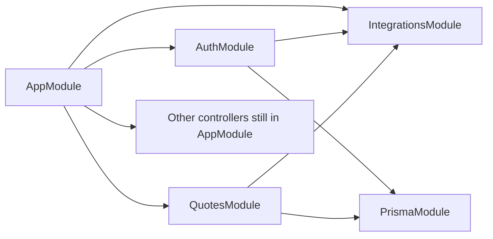

# Backend Architecture — JetBay API

**Target design** for `apps/api`. Không đổi public URL/contract khi refactor.  
**Audit hiện trạng:** [BE_AUDIT.md](./BE_AUDIT.md) · **Cập nhật:** 2026-07-10

---

## 1. Nguyên tắc

1. **Feature modules** theo domain báo giá — không 1 `AppModule` phẳng lâu dài.
2. **Không đổi path HTTP** khi di chuyển file (chỉ đổi import Nest).
3. Mọi admin/write DTO: **`class-validator` bắt buộc** (whitelist).
4. Controllers: `@ApiSecurity('X-API-Key')` class-level; JWT/Admin rõ trên method.
5. Infra (Prisma, Redis, Storage, Email, SMS, Payment gateways) → module dùng chung, export providers.
6. Secrets chỉ trong `.env` — không commit; prod không sync đè `.env`.

---

## 2. Target layout

```
apps/api/src/
  main.ts                 # bootstrap, CORS, Helmet, Swagger, assertProductionSecrets
  app.module.ts           # chỉ import feature modules + global guards config
  auth/                   # JwtStrategy, guards, decorators (giữ gần Passport)
  prisma/                 # PrismaModule @Global
  modules/
    auth/                 # AuthController + Auth/Otp/OAuth/Sms services
    quotes/               # Quote + AdminQuotes + related
    bookings/             # (phase 3)
    commercial/           # FP + EL + JetCard + TC (phase 2)
    content/              # CMS + Media (phase 4)
    admin/                # dashboard, users, airports, aircraft, partners (phase 5)
    integrations/         # Email, Payment, Onepay, Ninepay, Document, Redis, Storage, Audit
  dto.ts                  # tạm thời monolith → split theo module (phase 6)
```

### Hiện tại (phase 1)

- Controllers/services vẫn có thể nằm `src/controllers`, `src/services`.
- `AuthModule` / `QuotesModule` / `IntegrationsModule` **wire** providers; physical colocation folder là bước tiếp theo trong cùng phase khi ổn định.

---

## 3. Module boundaries



| Module | Owns | Imports |
|--------|------|---------|
| **IntegrationsModule** (@Global) | `AuditService`, `EmailService`, `PaymentService`, `DocumentService`, `OnepayService`, `NinepayService`, `RedisService`, `StorageService`, `SmsService` | Prisma |
| **AuthModule** | `AuthController`, `AuthService`, `OtpService`, `OAuthService`, `JwtStrategy` | Integrations (Audit/Sms), Prisma, Passport |
| **QuotesModule** | `QuoteController`, `AdminQuotesController`, `QuoteService`, `AdminQuotesService`, `BookingService` (shared until phase 3) | Integrations, Prisma |

Global: `ThrottlerGuard`, `ApiKeyGuard`, `JwtModule`, `ThrottlerModule`, `PrismaModule`.

---

## 4. AuthZ matrix (convention)

| Surface | ApiKey | JWT | Admin role |
|---------|--------|-----|------------|
| Health / Swagger / webhooks IPN | skip `@Public` | — | — |
| Public catalog / quote request | required | optional on quote request | — |
| `/me`, `/bookings`, `/quotes/my`, balances | required | required | — |
| `/admin/*` | required | required | required |

---

## 5. Refactor phases

| Phase | Work | Status |
|-------|------|--------|
| **1** | Docs audit + Integrations/Auth/Quotes modules + DTO sweep content | done (2026-07-10) |
| **2** | `CommercialModule` (FP/EL/JetCard/TC) | planned |
| **3** | `BookingsModule` + payment routes ownership | planned |
| **4** | `ContentModule` + Media | planned |
| **5** | `AdminModule` (dashboard/users/airports/aircraft/partners) | planned |
| **6** | Split `dto.ts` → `modules/*/dto/*.ts` | planned |

Mỗi phase: `tsc` + jest + `smoke-admin-crud.mjs` + `smoke-web-api.mjs` trước deploy.

---

## 6. Definition of Done (module extract)

- [x] `AppModule` imports feature module (không list từng controller của domain đó)
- [x] Không đổi OpenAPI paths
- [ ] Smoke local 16/16 admin + 8/8 web
- [x] Cập nhật [BE_AUDIT.md](./BE_AUDIT.md) status nếu có gap mới

---

## 7. Liên kết

[BE_AUDIT.md](./BE_AUDIT.md) · [API.md](./API.md) · [DATABASE.md](./DATABASE.md) · [JETBAY_SECURITY_VS_FEATURES.md](./JETBAY_SECURITY_VS_FEATURES.md) · [GIT_WORKFLOW.md](./GIT_WORKFLOW.md) (`feat/api-*`)
