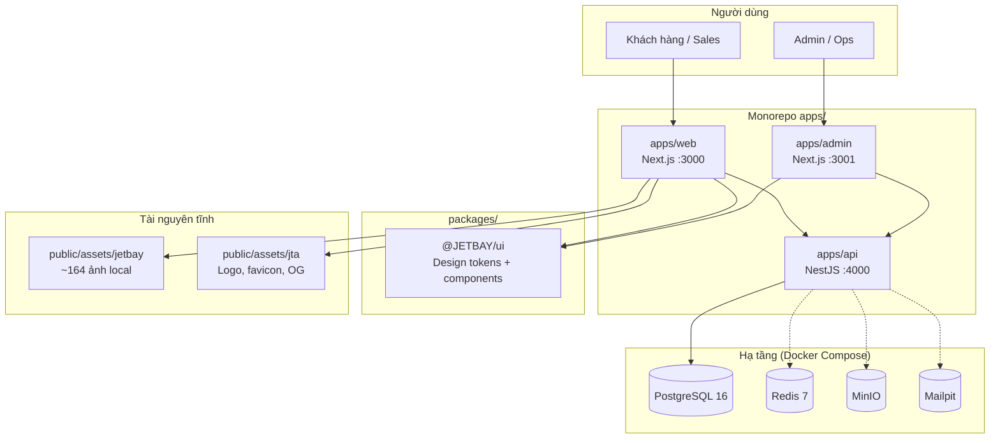

# Đánh giá kỹ thuật & phân rã báo giá — nền tảng JETBAY Private Jet Charter

> **Báo giá gửi khách hàng (phiên bản trình bày):** xem [`JETBAY_BAO_GIA.md`](./JETBAY_BAO_GIA.md)  
> **Sản phẩm (clone):** `apps/web` → local http://localhost:3000/en-us · xem [JETBAY_PRODUCT_MAP.md](./JETBAY_PRODUCT_MAP.md)  
> **Báo giá (collateral):** [m-tien.com/jet-bay](https://m-tien.com/jet-bay/) — không phải app clone

**Phiên bản tài liệu:** 1.0  
**Ngày:** 30/06/2026  
**Đối tượng:** Báo giá triển khai / hoàn thiện hệ thống gửi khách hàng  
**Mã dự án:** `JETBAY-platform` (monorepo `baogia`)

---

## 1. Tóm tắt điều hành

Dự án là **nền tảng đặt thuê máy bay tư nhân (private jet charter)** theo mô hình clean-room, gồm **3 ứng dụng** và **1 thư viện UI dùng chung**, kết nối **REST API + PostgreSQL**. Phần lớn luồng nghiệp vụ cốt lõi (báo giá, sản phẩm thương mại, CMS, admin dashboard) **đã có code và schema DB**; còn lại chủ yếu là **hoàn thiện UI clone**, **form CRUD admin**, **tích hợp thanh toán/email**, và **triển khai production**.

| Chỉ số | Giá trị |
|--------|---------|
| Ứng dụng | Web (công khai), Admin (nội bộ), API (backend) |
| Cổng mặc định | Web `:3000` · Admin `:3001` · API `:4000` |
| Ngôn ngữ / framework | TypeScript · Next.js 16 · NestJS 11 · Prisma 5 |
| Trang web (locale) | 29 route · 6 locale (`en-us`, `en`, `zh-cn`, `zh-hk`, `zh-tw`, `vi`) |
| API endpoint | ~70+ route · 17 controller |
| Model database | 28 bảng Prisma |
| Trang admin | 17 màn hình |
| Mức hoàn thiện ước lượng | **~70–75%** chức năng lõi · **~55–60%** polish UI/clone · **~40%** production-ready |

---

## 2. Kiến trúc hệ thống



**Luồng dữ liệu chính**

1. Web/Admin gọi API qua `fetch` (`apps/web/src/lib/api.ts`, `apps/admin/src/lib/api.ts`).
2. API xác thực JWT → service layer → Prisma → PostgreSQL.
3. Nội dung CMS (About Us, Booking Process, News…) lưu JSON/text trong `ContentArticle` + `ContentTranslation`.
4. Ảnh marketing mirror local từ CDN tham chiếu (`scripts/download-jetbay-assets.mjs`), không phụ thuộc CDN runtime.

---

## 3. Cây thư mục dự án (chi tiết)

### 3.1. Gốc monorepo

```
baogia/
├── apps/
│   ├── web/                 # Website công khai (Next.js App Router)
│   ├── admin/               # Dashboard quản trị
│   └── api/                 # Backend REST + Prisma
├── packages/
│   └── ui/                  # @JETBAY/ui — component dùng chung
├── scripts/                 # Tải asset, rebrand, parse HTML mẫu
├── docs/                    # Tài liệu kỹ thuật & sprint
├── tests/                   # Playwright e2e + API tests
├── scratch/                 # HTML gốc jet-bay.com (tham chiếu clone)
├── docker-compose.yml         # Postgres, Redis, MinIO, Mailpit
├── pnpm-workspace.yaml
└── package.json             # dev, build, db:up, assets:jetbay
```

### 3.2. `apps/web` — Website công khai

```
apps/web/
├── public/
│   └── assets/
│       ├── jetbay/          # Ảnh clone (banner, aircraft, destinations…)
│       └── jta/             # Brand JETBAY (logo, favicon, OG)
└── src/
    ├── app/
    │   ├── layout.tsx       # Metadata, favicon, OG mặc định
    │   ├── page.tsx         # Redirect → locale
    │   └── [locale]/        # 29 trang (xem mục 5)
    ├── components/
    │   ├── home/            # Hero, Promo, FixedPrice, EmptyLegs, Stats…
    │   ├── layout/          # Header, Footer, ServicePage, PageHero…
    │   ├── forms/           # Quote, JetCard, EmptyLeg, WorldCup…
    │   ├── destinations/    # DestinationExplorer (filter BE)
    │   ├── charter/         # AircraftCarousel
    │   └── pages/           # AboutUsPage, BookingProcessPage
    ├── config/
    │   ├── jetbay-cdn.ts    # Map asset local + page content CDN
    │   ├── navigation.ts    # Menu, footer links
    │   ├── locales.ts
    │   └── destination-categories.ts
    ├── lib/
    │   ├── api.ts           # 30+ API client methods
    │   ├── page-content.ts  # Copy tĩnh service pages
    │   ├── about-us-default.ts
    │   ├── booking-process-default.ts
    │   ├── aircraft-catalog.ts
    │   ├── brand.ts         # JETBAY rebrand
    │   └── metadata.ts      # SEO / OpenGraph
    └── styles/
        ├── jetbay-home.css
        └── jetbay-polish.css
```

### 3.3. `apps/admin` — Quản trị

```
apps/admin/src/
├── app/
│   ├── login/
│   └── dashboard/
│       ├── page.tsx              # Overview stats
│       ├── quotes/
│       ├── bookings/
│       ├── fixed-price/
│       ├── empty-legs/
│       ├── jet-card/
│       ├── travel-credits/
│       ├── partners/
│       ├── destinations/
│       ├── airports/
│       ├── users/                # Placeholder
│       ├── media/                # Placeholder
│       ├── audit-logs/
│       ├── settings/
│       └── content/
│           ├── page.tsx
│           ├── pages/
│           ├── about-us/         # CMS editor đầy đủ
│           └── booking-process/  # CMS editor đầy đủ
├── components/
│   ├── AdminShell.tsx            # Sidebar nav
│   └── AdminAuthGate.tsx
└── lib/api.ts                    # adminApi client
```

### 3.4. `apps/api` — Backend

```
apps/api/
├── prisma/
│   ├── schema.prisma        # 28 models
│   ├── seed.ts              # Demo data + admin user
│   └── migrations/
└── src/
    ├── main.ts              # Swagger, CORS, Helmet, ValidationPipe
    ├── dto.ts               # Toàn bộ DTO Swagger
    ├── app.module.ts
    ├── auth/                # JWT strategy, guards, @CurrentUser
    ├── prisma/
    ├── controllers/         # 17 controllers (mục 6)
    ├── services/            # 13 services (business logic)
    └── constants/
        ├── api-ui-registry.ts
        ├── about-us-cms.ts
        ├── booking-process-cms.ts
        └── destination-seeds.ts
```

### 3.5. `packages/ui`

```
packages/ui/src/
├── tokens.ts        # colors, spacing (JETBAY theme)
├── components.tsx   # PageShell, Card, DataTable, Button, Input, Badge
└── index.ts
```

---

## 4. Cây chức năng nghiệp vụ (Feature Tree)

```
JETBAY Platform
│
├── A. Marketing & Discovery (Web)
│   ├── A1. Trang chủ (Hero, Promo, Fixed Price, Empty Legs, Destinations, Jet Card, Stats, Media)
│   ├── A2. Dịch vụ charter (private / corporate / group / event / pet / air-ambulance)
│   ├── A3. Sản phẩm thương mại (Fixed Price, Empty Leg, Jet Card, Travel Credit)
│   ├── A4. Điểm đến (hub + island + filter category BE)
│   ├── A5. Nội dung (News, Blogs, Video Centre, Legal pages)
│   ├── A6. Trang thương hiệu (About Us CMS, Booking Process CMS)
│   ├── A7. Chiến dịch (World Cup 2026)
│   └── A8. Đối tác (Global Partnership Program)
│
├── B. Đặt chỗ & Báo giá
│   ├── B1. Widget tìm chuyến bay (airport search, aircraft search)
│   ├── B2. Gửi yêu cầu báo giá (Quote Request → DB)
│   ├── B3. Đặt Fixed Price / Empty Leg / World Cup
│   ├── B4. Form Jet Card / Travel Credit / Partner enquiry
│   └── B5. Booking lifecycle (tạo, xem, hủy)
│
├── C. Tài khoản người dùng
│   ├── C1. Đăng ký / Đăng nhập (email + JWT)
│   ├── C2. Portal /account (profile cơ bản, bookings)
│   ├── C3. [Chưa] OAuth Google/Apple
│   └── C4. [Chưa] Sub-pages account (quotes, jet-card balance…)
│
├── D. CMS & Nội dung
│   ├── D1. Articles (NEWS, BLOG, PAGE, LEGAL) + i18n
│   ├── D2. Videos
│   ├── D3. Destinations (ISLAND / SKI / GOLF)
│   ├── D4. About Us — JSON CMS + editor admin
│   └── D5. Booking Process — JSON CMS + editor admin
│
├── E. Admin & Vận hành
│   ├── E1. Dashboard (stats, recent quotes/bookings, revenue demo)
│   ├── E2. Danh sách (quotes, bookings, commercial, partners, content)
│   ├── E3. CMS editors (about-us, booking-process)
│   ├── E4. [Một phần] CRUD form tạo/sửa cho từng module
│   ├── E5. Audit logs + system health
│   └── E6. [Chưa] User management, Media library (MinIO)
│
└── F. Hạ tầng & Production
    ├── F1. PostgreSQL + Prisma migrate/seed
    ├── F2. [Chưa] Redis cache / session
    ├── F3. [Chưa] MinIO upload media
    ├── F4. [Chưa] Email (Mailpit → SMTP production)
    ├── F5. [Chưa] Stripe / cổng thanh toán
    ├── F6. [Chưa] Rate limiting, OAuth, CI/CD
    └── F7. SEO, favicon, OG (đã có cơ bản JETBAY)
```

---

## 5. Ma trận trang Web (`/{locale}/…`)

| # | Route | Mô tả | Nguồn dữ liệu | Form / Action | % UI clone |
|---|-------|-------|-----------------|---------------|------------|
| 1 | `/` | Trang chủ | API: fixed-price, empty-legs, jet-card | Quote widget | ~80% |
| 2 | `/private-jet-charter` | Charter chính | Static + aircraft carousel | Quote widget | ~75% |
| 3 | `/corporate-air-charter` | Doanh nghiệp | Static `page-content` | Quote | ~50% |
| 4 | `/group-air-charter` | Nhóm | Static | Quote | ~50% |
| 5 | `/event-air-charter` | Sự kiện | Static | Quote | ~50% |
| 6 | `/pet-travel` | Thú cưng | Static | Quote | ~50% |
| 7 | `/air-ambulance` | Cấp cứu | Static | Quote | ~50% |
| 8 | `/fixed-price-charter` | DS giá cố định | API routes | — | ~70% |
| 9 | `/fixed-price-charter/[slug]` | Chi tiết route | API route | FixedPriceBookForm | ~65% |
| 10 | `/empty-leg` | Empty leg list | API | Alert subscribe | ~70% |
| 11 | `/empty-leg-recommendation/[slug]` | Chi tiết empty leg | API | EmptyLegRequestForm | ~65% |
| 12 | `/jet-card` | Jet Card | API plans | Enquiry + FAQ table | ~75% |
| 13 | `/travel-credit` | Travel Credit | API packages | Enquiry form | ~65% |
| 14 | `/destination` | Hub điểm đến | API + filter | Search/tab | ~70% |
| 15 | `/island-destinations` | Đảo | API ISLAND | — | ~70% |
| 16 | `/news`, `/news/[slug]` | Tin tức | API CMS | — | ~60% |
| 17 | `/blogs`, `/blogs/[slug]` | Blog | API CMS | — | ~60% |
| 18 | `/video-centre` | Video | API videos | — | ~55% |
| 19 | `/article/[slug]` | Legal/CMS | API pages | — | ~50% |
| 20 | `/about-us` | Giới thiệu | CMS JSON + layout | — | ~85% |
| 21 | `/booking-process` | Quy trình đặt | CMS JSON + layout | CTA search | ~80% |
| 22 | `/global-partnership-program` | Đối tác | API programs | Application form | ~55% |
| 23 | `/world-cup-2026-private-jet-booking` | World Cup | API matches | WorldCupQuoteForm | ~60% |
| 24 | `/world-cup-final-2026-private-jet-charter` | WC Final | Static + campaign | — | ~50% |
| 25 | `/jetbay-private-jet-app` | App mobile | Static | — | ~45% |
| 26 | `/login`, `/register` | Auth | API auth | Form | ~60% |
| 27 | `/account` | Tài khoản | /me, bookings | — | ~40% |

---

## 6. Ma trận API (nhóm theo module)

### 6.1. Public API

| Module | Endpoints chính | DB | Ghi chú |
|--------|-----------------|-----|---------|
| Auth | register, login, refresh, /me | ✅ | OAuth stub |
| Airports | search, list | ✅ | Autocomplete widget |
| Quotes | search-aircraft, request | ✅ | Core funnel |
| Bookings | create, my, detail, cancel | ✅ | Account portal |
| Fixed Price | routes, route/:slug, quote | ✅ | Region US/EU/Asia |
| Empty Legs | list, slug, subscribe, request | ✅ | |
| Jet Card | plans, enquiries, balance | ✅ | Balance cần account |
| Travel Credits | packages, enquiries, redeem | ✅ | |
| Partners | programs, applications, dashboard | ✅ | |
| Content | news, blogs, videos, destinations, pages | ✅ | i18n locale param |
| Campaign | world-cup matches, quotes | ✅ | |
| Newsletter | subscribe | ✅ | |

### 6.2. Admin API (JWT + AdminGuard)

| Module | CRUD | Ghi chú |
|--------|------|---------|
| Dashboard | stats, recent, revenue, health, audit | Revenue = demo |
| Bookings | list, detail, status | |
| Fixed Price | create, patch, delete routes | UI list only |
| Empty Legs | full CRUD | UI list only |
| Jet Card | full CRUD plans | UI list only |
| Travel Credits | transactions list | |
| Partners | applications list | |
| Content | pages, articles, videos, destinations | Editors: about-us, booking-process |

---

## 7. Database — 28 models (nhóm logic)

```
Auth & B2B          Quote & Booking       Aircraft & Ops
─────────────       ───────────────       ──────────────
User                QuoteRequest          Airport
UserAuthProvider    QuoteLeg              AircraftCategory
Company             QuoteOffer            AircraftModel
CompanyAuthorized   Booking               Operator
                    BookingPassenger
                    Payment               Commercial
                    Document              ──────────────
                                          FixedPriceRoute
CMS & Campaign                            FixedPriceOption
─────────────                             EmptyLegOffer
ContentCategory                           JetCardPlan
ContentArticle                            JetCardAccount
ContentTranslation                        JetCardTransaction
Video                                     TravelCreditLedger
Destination
WorldCupMatch       Misc
WorldCupItinerary   ──────────────
                    SavedSearch
                    ConsentLog
                    AuditLog

Partner
─────────────
PartnerProgram
PartnerApplication
PartnerAccount
```

---

## 8. Phân rã gói công việc báo giá (Work Packages)

> **Cách đọc:** Mỗi gói (WP) là một hạng mục có thể báo giá riêng. Cột **Trạng thái** phản ánh code hiện tại. **Effort** là ước lượng còn lại (người-ngày, 1 dev fullstack), để tham khảo đàm phán — **không phải cam kết cố định**.

### WP-00 — Nền tảng & DevOps (cơ sở)

| Hạng mục | Mô tả | Trạng thái | Effort còn lại |
|----------|-------|------------|----------------|
| Monorepo pnpm | web + admin + api + ui | ✅ Xong | 0 |
| Docker Compose | Postgres, Redis, MinIO, Mailpit | ✅ Provision | 2–3 ngày (wire Redis/MinIO/Mailpit) |
| CI/CD | Build, test, deploy staging/prod | ⬜ Chưa | 5–8 ngày |
| ENV & secrets | .env mẫu, production checklist | 🟡 Một phần | 1–2 ngày |

### WP-01 — Backend API lõi

| Hạng mục | Mô tả | Trạng thái | Effort còn lại |
|----------|-------|------------|----------------|
| Prisma schema 28 models | Migrate + seed | ✅ | 1 ngày (fix quyền DB môi trường KH) |
| Auth JWT + bcrypt | Register/login/refresh/me | ✅ | 2 ngày (revoke token, rate limit) |
| Quote + Booking | Full persist + audit | ✅ | 1–2 ngày (edge cases) |
| Commercial APIs | Fixed/Empty/JetCard/Credits | ✅ | 1 ngày |
| CMS APIs | Content + destinations + i18n | ✅ | 0.5 ngày |
| OAuth Google/Apple | Social login | ⬜ Stub | 4–6 ngày |
| Payment gateway | Stripe intent/confirm/webhook | ⬜ Stub DB only | 8–12 ngày |
| Email service | Transactional (quote confirm…) | ⬜ | 4–6 ngày |

### WP-02 — Website công khai (UI/UX clone)

| Hạng mục | Mô tả | Trạng thái | Effort còn lại |
|----------|-------|------------|----------------|
| Home sections | Hero → Media, API-driven | ✅ ~80% | 3–5 ngày polish |
| Header/Footer/Nav | Multi-locale menu | 🟡 ~70% | 2–3 ngày |
| Service pages (6) | charter, corporate, pet… | 🟡 ~50% | 8–12 ngày rich content |
| Private jet charter | Aircraft carousel, FAQ, process | ✅ ~75% | 2–3 ngày |
| Fixed Price + Empty Leg | List + detail + forms | ✅ ~70% | 3–4 ngày |
| Jet Card + Travel Credit | Comparison, FAQ, forms | ✅ ~70% | 2–3 ngày |
| Destinations | Filter BE, 14 destinations seed | ✅ ~75% | 2 ngày |
| About Us + Booking Process | CMS layout clone | ✅ ~80% | 1–2 ngày |
| News/Blogs/Video | API lists + detail | 🟡 ~60% | 4–5 ngày |
| World Cup campaign | Matches + quote form | 🟡 ~60% | 2–3 ngày |
| Partner program | Programs + application | 🟡 ~55% | 2 ngày |
| Quote widget | Airport search, submit quote | ✅ | 2 ngày UX validation |
| Responsive mobile | Stats carousel, tabs, grids | 🟡 ~65% | 5–8 ngày audit toàn site |
| SEO + OG + favicon JETBAY | metadata, brand assets | ✅ Cơ bản | 1 ngày (PNG OG, analytics) |
| i18n content | 6 locale routing | 🟡 Route only | 10–15 ngày dịch CMS |

### WP-03 — Admin Dashboard

| Hạng mục | Mô tả | Trạng thái | Effort còn lại |
|----------|-------|------------|----------------|
| Login + JWT gate | adminApi | ✅ | 0.5 ngày |
| Overview dashboard | Stats, recent lists | ✅ | 1 ngày (real revenue) |
| List views | quotes, bookings, commercial… | ✅ | 1 ngày |
| CMS About Us editor | Full form | ✅ | 0.5 ngày |
| CMS Booking Process editor | Full form | ✅ | 0.5 ngày |
| Destinations admin | List + filter | ✅ | 2 ngày (CRUD form) |
| CRUD forms | Create/edit airports, routes, legs… | ⬜ | 12–18 ngày |
| User management | Roles, ban, reset | ⬜ Placeholder | 4–5 ngày |
| Media library | MinIO upload + picker | ⬜ Placeholder | 6–8 ngày |
| Rich text editor | Articles body WYSIWYG | ⬜ | 4–6 ngày |

### WP-04 — Tài khoản khách hàng

| Hạng mục | Mô tả | Trạng thái | Effort còn lại |
|----------|-------|------------|----------------|
| Login / Register | Email password | ✅ | 1 ngày |
| /account hub | Profile + bookings list | 🟡 | 3–4 ngày |
| /account/quotes | Lịch sử báo giá | ⬜ | 2–3 ngày |
| /account/jet-card | Số giờ còn lại | ⬜ | 3 ngày |
| /account/travel-credits | Số dư credit | ⬜ | 2–3 ngày |
| Saved searches | API model có, UI chưa | ⬜ | 2 ngày |

### WP-05 — QA, bảo mật, hiệu năng

| Hạng mục | Mô tả | Trạng thái | Effort còn lại |
|----------|-------|------------|----------------|
| Playwright e2e | Home, admin, quote | ✅ Cơ bản | 4–6 ngày mở rộng |
| API unit tests | Jest/Supertest | ✅ Cơ bản | 3–4 ngày |
| Helmet + CORS + Validation | API hardening | ✅ | 1 ngày |
| Rate limiting | API gateway | ⬜ | 2 ngày |
| Performance | Image, cache, DB indexes | 🟡 | 3–5 ngày |
| Security audit | OWASP checklist | 🟡 | 3–4 ngày |

### WP-06 — Tài sản & thương hiệu

| Hạng mục | Mô tả | Trạng thái | Effort còn lại |
|----------|-------|------------|----------------|
| Mirror CDN jetbay | 164 assets local | ✅ | Bảo trì khi thêm trang |
| Rebrand JETBAY | Logo, text replace | ✅ | 0.5 ngày |
| Favicon / OG | SVG JETBAY | ✅ | 0.5 ngày (export PNG) |
| Copywriting | Thay nội dung marketing | ⬜ | Theo scope KH |

---

## 9. Tổng hợp effort tham khảo (báo giá)

| Giai đoạn | Phạm vi | Effort ước lượng (người-ngày) |
|-----------|---------|-------------------------------|
| **P0 — Đã làm** | Monorepo, API lõi, CMS, home, commercial pages, admin lists, clone ~70% | *(đã đầu tư ~80–120 ND)* |
| **P1 — MVP go-live** | Fix DB/deploy, responsive, CRUD admin cơ bản, email, polish 10 trang chính | **25–35 ND** |
| **P2 — Parity clone** | 6 service pages rich, news/video, i18n zh, account sub-pages | **30–45 ND** |
| **P3 — Production** | Stripe, OAuth, Redis, MinIO, CI/CD, security audit | **35–50 ND** |
| **P4 — Vận hành** | Monitoring, SLA, training admin, tài liệu bàn giao | **8–12 ND** |

> **Gợi ý báo giá:** Tách line-item theo bảng WP-00 → WP-06; nhân đơn giá người-ngày theo hợp đồng. Có thể gói **Fixed Price theo phase** (P1/P2/P3) để khách hàng chọn mức độ hoàn thiện.

---

## 10. Phụ thuộc & rủi ro

| Rủi ro | Mức | Giảm thiểu |
|--------|-----|------------|
| PostgreSQL chưa cấu hình đúng (`jta_user` denied) | Cao | Docker hoặc DB managed + migrate/seed |
| Docker chưa cài trên máy dev KH | Trung bình | Hướng dẫn cài hoặc DB cloud |
| Clone UI 100% jet-bay.com | Trung bình | Scope rõ từng trang; HTML scratch làm baseline |
| Thanh toán / OAuth phụ thuộc bên thứ 3 | Trung bình | Stripe/Google console của KH |
| Đa ngôn ngữ nội dung | Thấp–Trung bình | CMS có sẵn; cần dịch thuật |
| Bản quyền asset gốc | Pháp lý | Đã mirror local + rebrand JETBAY; KH cần asset riêng cho production |

---

## 11. Deliverables bàn giao đề xuất

| # | Hạng mục bàn giao |
|---|-------------------|
| 1 | Source code monorepo (web + admin + api + ui) |
| 2 | PostgreSQL schema + migrations + seed script |
| 3 | Docker Compose + hướng dẫn `pnpm dev` |
| 4 | Swagger API docs (`/swagger`) + `docs/API.md` |
| 5 | Tài liệu triển khai `docs/DEPLOYMENT.md` |
| 6 | Bộ test Playwright + hướng dẫn chạy |
| 7 | Tài khoản admin seed + tài liệu vận hành CMS |
| 8 | Asset JETBAY (logo, favicon, OG) + ~164 ảnh marketing local |

---

## 12. Phụ lục — Lệnh vận hành

```powershell
pnpm install
pnpm db:up                    # Cần Docker
pnpm --filter @jetbay/api prisma:migrate
pnpm --filter @jetbay/api prisma:seed
pnpm dev                      # Web :3000 | Admin :3001 | API :4000
pnpm assets:jetbay            # Tải thêm ảnh CDN
```

**Tài khoản demo (sau seed):**

| Vai trò | Email | Mật khẩu |
|---------|-------|----------|
| Admin | admin@JETBAY.local | Admin123! |
| User | demo@JETBAY.local | Demo123! |

---

## 13. Tài liệu liên quan trong repo

| File | Nội dung |
|------|----------|
| `docs/SPRINT_PROMPTS.md` | 35 sprint roadmap + tiến độ |
| `docs/API_UI_AUDIT.md` | Ma trận web ↔ API |
| `docs/FEATURE_MATRIX.md` | Ma trận tính năng |
| `docs/BE_AUDIT.md` | Audit backend & bảo mật |
| `docs/QA_REPORT.md` | Kết quả build & smoke test |
| `docs/DEPLOYMENT.md` | Kiến trúc triển khai |
| `docs/DATABASE.md` | Mô tả schema |

---

*Tài liệu này được sinh từ khảo sát codebase thực tế (`apps/`, `packages/`, `prisma/schema.prisma`) ngày 30/06/2026. Cập nhật khi scope hoặc mức hoàn thiện thay đổi.*
