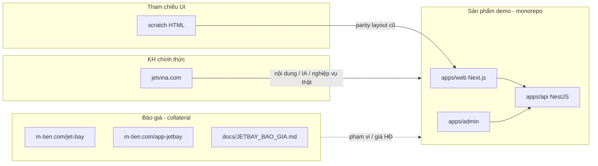

# JETBAY — Bản đồ sản phẩm vs báo giá

> **Chốt (2026-07-12):** Web **chính thức của khách hàng** = **[https://jetvina.com/](https://jetvina.com/)** (JetVina — Vietnam Private Jet & Air Charter).  
> Code sản phẩm demo/clone nằm trong `apps/web` (hiện brand JetBay trên `minhtien.online`).  
> `m-tien.com/jet-bay` chỉ là **báo giá bán hàng**, không phải trang chính thức của KH.

---

## 1. Ba lớp — đừng lẫn

| Lớp | Là gì | URL / path | Việc cần làm |
|-----|--------|------------|--------------|
| **Chính thức KH** | JetVina live | https://jetvina.com/ | **Nguồn truth** IA, dịch vụ, Empty Legs, membership, liên hệ |
| **Sản phẩm demo** | Clone/platform trong monorepo | Code: `apps/web` · Prod: https://www.minhtien.online/en-us · Local `:3000` | Polish theo JetVina + CR; brand code có thể còn “JetBay” đến khi rebrand |
| **API / Admin** | Backend + CMS | `api.minhtien.online` · `admin.minhtien.online` | Đã live |
| **Báo giá** | Pitch / giá gói | `m-tien.com/jet-bay` · `docs/JETBAY_BAO_GIA.md` | Chỉ đọc số tiền — **không** coi là web KH |
| **Scratch** | HTML tham chiếu cũ | `scratch/` | So layout; ưu tiên JetVina khi lệch |

---

## 1b. JetVina — thông tin chính thức (rút gọn)

Nguồn: [jetvina.com](https://jetvina.com/)

| Hạng mục | Nội dung |
|----------|----------|
| Brand | **JetVina** — Vietnam-based private jet / air charter |
| Slogan / focus | Flying private in Vietnam and Asia Pacific |
| Nav chính | Air Charter · Aircrafts (Bombardier, Gulfstream, Embraer, Cessna, Dassault, Beechcraft, Helicopter) · Empty Legs · Experience (Hotel/Villa, Yacht) · Private Life / Events · Membership (JetVina25, Corporate) · About · News · Contact |
| Locale | en · vi · ru · zh-hans · ko |
| Contact | +84 396 919 611 · flights@jetvina.com |
| VP | Phu Quoc · TSN Terminal 03 (Bay Hien) |
| Pháp lý | Coral Mountain Travel Services And Trading Co., Ltd · MST 1702247183 |

**Không** dùng `jetbay.com` làm nguồn “web chính thức KH” khi nói với Anh Tuấn Anh / nội bộ sau ngày chốt này.

---

## 2. Trang chính (product demo) ở đâu?

| | |
|--|--|
| **Home clone** | [`apps/web/src/app/[locale]/page.tsx`](../apps/web/src/app/[locale]/page.tsx) |
| **Sections** | [`apps/web/src/components/home/`](../apps/web/src/components/home/) |
| **Các trang con** | [`apps/web/src/app/[locale]/`](../apps/web/src/app/[locale]/) |
| **Mẫu HTML cũ** | [`scratch/`](../scratch/) |
| **Chạy local** | `pnpm --filter @jetbay/web dev` → http://localhost:3000/en-us |

**Không** mở `m-tien.com/jet-bay` khi muốn xem / sửa sản phẩm. So nội dung với **jetvina.com**.

---

## 3. URL nhanh (đúng vai trò)

### Sản phẩm (đang / sẽ chạy)

| Service | URL | Trạng thái |
|---------|-----|------------|
| Web clone | https://www.minhtien.online/en-us · Local `:3000` | ✅ live (`jetbay-web` `:3012`) |
| API | https://api.minhtien.online | ✅ |
| Admin | https://admin.minhtien.online/login | ✅ |
| Swagger | https://docs.minhtien.online/swagger | ✅ |

### Báo giá (chỉ mô tả)

| | URL |
|--|-----|
| Gói Web 74TR | https://m-tien.com/jet-bay/ |
| Gói App 248TR | https://m-tien.com/app-jetbay/ |
| Phiếu trong repo | [JETBAY_BAO_GIA.md](./JETBAY_BAO_GIA.md) |

---

## 4. Quy hoạch việc tiếp (ưu tiên sản phẩm)

1. **P0 — Định hướng docs** — ✅ tách báo giá / sản phẩm  
2. **P1 — Deploy `apps/web`** — ✅ `www.minhtien.online` → PM2 `jetbay-web` `:3012`  
3. **P2 — Polish clone** theo `scratch/` + [JETBAY_WEB_PAGE_DOD.md](./JETBAY_WEB_PAGE_DOD.md) (charter rich, commercial, account)  
4. **P3 — App RN** chỉ sau cổng API xanh + thỏa thuận KH (không nhầm với landing `app-jetbay`)

Nhánh code: `feat/web-*` cho mọi việc clone UI.

---

## 5. Tài liệu liên quan

| Doc | Vai trò sau quy hoạch |
|-----|------------------------|
| [CONTINUE_AT_HOME.md](./CONTINUE_AT_HOME.md) | Entry hàng ngày — ưu tiên product |
| [JETBAY_WEB_PAGE_DOD.md](./JETBAY_WEB_PAGE_DOD.md) | DoD trang clone |
| [JETBAY_BAO_GIA.md](./JETBAY_BAO_GIA.md) | Báo giá (collateral) |
| [JETBAY_DELIVERY_CHECKLIST.md](./JETBAY_DELIVERY_CHECKLIST.md) | DoD giao hàng |
| [AGENTS.md](../AGENTS.md) | AI: product trước, báo giá chỉ scope |
