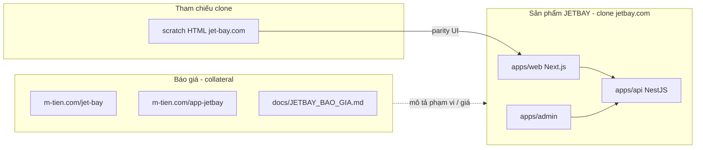

# JETBAY — Bản đồ sản phẩm vs báo giá

> **Chốt:** Trang chính cần làm / demo sản phẩm = **clone jetbay.com** trong `apps/web`.  
> Trang `m-tien.com/jet-bay` và `m-tien.com/app-jetbay` chỉ là **mô tả báo giá** (bán hàng), không phải app clone.

---

## 1. Hai lớp — đừng lẫn

| Lớp | Là gì | URL / path | Việc cần làm |
|-----|--------|------------|--------------|
| **Sản phẩm** | Clone jetbay.com | Code: `apps/web` · Prod: https://www.minhtien.online/en-us · Local: `:3000` | Polish UI vs `scratch/` |
| **API / Admin** | Backend + CMS | `api.minhtien.online` · `admin.minhtien.online` | Đã live |
| **Báo giá** | Pitch / giá gói | `m-tien.com/jet-bay` · `m-tien.com/app-jetbay` · `docs/JETBAY_BAO_GIA.md` | Chỉ đọc / cập nhật số tiền — **không** coi là trang chính |
| **Scratch** | HTML gốc để so | `scratch/` | Tham chiếu clone, không ship |

---

## 2. Trang chính (product) ở đâu?

| | |
|--|--|
| **Home clone** | [`apps/web/src/app/[locale]/page.tsx`](../apps/web/src/app/[locale]/page.tsx) |
| **Sections** | [`apps/web/src/components/home/`](../apps/web/src/components/home/) |
| **Các trang con** | [`apps/web/src/app/[locale]/`](../apps/web/src/app/[locale]/) |
| **Mẫu HTML** | [`scratch/`](../scratch/) (so với jet-bay.com) |
| **Chạy local** | `pnpm --filter @jetbay/web dev` → http://localhost:3000/en-us |

**Không** mở `m-tien.com/jet-bay` khi muốn xem / sửa clone.

---

## 3. URL nhanh (đúng vai trò)

### Sản phẩm (đang / sẽ chạy)

| Service | URL | Trạng thái |
|---------|-----|------------|
| Web clone | https://www.minhtien.online/en-us · Local `:3000` | ✅ live (`jetbay-web` `:3012`) |
| API | https://api.minhtien.online | ✅ |
| Admin | https://admin.minhtien.online/login | ✅ |
| Swagger | https://docs.minhtien.online/swagger | ✅ |

### Báo giá (chỉ mô tả)

| | URL |
|--|-----|
| Gói Web 74TR | https://m-tien.com/jet-bay/ |
| Gói App 248TR | https://m-tien.com/app-jetbay/ |
| Phiếu trong repo | [JETBAY_BAO_GIA.md](./JETBAY_BAO_GIA.md) |

---

## 4. Quy hoạch việc tiếp (ưu tiên sản phẩm)

1. **P0 — Định hướng docs** — ✅ tách báo giá / sản phẩm  
2. **P1 — Deploy `apps/web`** — ✅ `www.minhtien.online` → PM2 `jetbay-web` `:3012`  
3. **P2 — Polish clone** theo `scratch/` + [JETBAY_WEB_PAGE_DOD.md](./JETBAY_WEB_PAGE_DOD.md) (charter rich, commercial, account)  
4. **P3 — App RN** chỉ sau cổng API xanh + thỏa thuận KH (không nhầm với landing `app-jetbay`)

Nhánh code: `feat/web-*` cho mọi việc clone UI.

---

## 5. Tài liệu liên quan

| Doc | Vai trò sau quy hoạch |
|-----|------------------------|
| [CONTINUE_AT_HOME.md](./CONTINUE_AT_HOME.md) | Entry hàng ngày — ưu tiên product |
| [JETBAY_WEB_PAGE_DOD.md](./JETBAY_WEB_PAGE_DOD.md) | DoD trang clone |
| [JETBAY_BAO_GIA.md](./JETBAY_BAO_GIA.md) | Báo giá (collateral) |
| [JETBAY_DELIVERY_CHECKLIST.md](./JETBAY_DELIVERY_CHECKLIST.md) | DoD giao hàng |
| [AGENTS.md](../AGENTS.md) | AI: product trước, báo giá chỉ scope |
