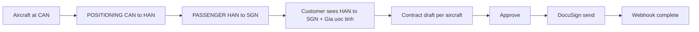

# Ops charter flow — Empty Leg · Giá ước tính · Hợp đồng DocuSign · RBAC

## Luồng nghiệp vụ (CAN → HAN → SGN)

| Yêu cầu | API / UI | Trạng thái |
|---------|----------|------------|
| Empty leg theo châu lục | `GET /empty-legs?continentCode=AS` · web EmptyLegBrowse | Có |
| Giá theo giờ + min billable | `POST /pricing/estimate` | Có |
| Positioning từ chỗ đậu → đón → đích | Legs POSITIONING + PASSENGER; customerRouteSummary | Có |
| Phí SB + canParkAircraft | Airport fees; không tính overnight nếu `canParkAircraft=false` | Có |
| Hợp đồng / mẫu / duyệt trước DocuSign | `/admin/contracts*` · send blocked until APPROVED | Có (mock DS) |
| Hủy theo user + tick ALLOW/DENY | `booking.cancel` + admin Permissions ticks | Có |
| Scope airport theo user | `UserAirportScope` · admin airports filtered | Có |

## Demo seed (sau migrate)

- Aircraft `B-JBAY1` @ CAN, hourly USD 8500, min 2h
- `sales.vn@jetbay.local` / `Sales123!` — scope VN
- `sales.nocancel@jetbay.local` — DENY `booking.cancel` → 403 khi hủy
