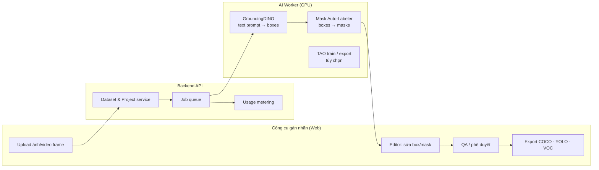

# Phụ lục báo giá — Module AI gán nhãn (NVIDIA TAO 5.5 + GroundingDINO)

**Đơn vị báo giá:** Minh Tiến Solutions  
**Tham chiếu:** [NVIDIA TAO 5.5 — Auto-labeling & GroundingDINO](https://developer.nvidia.com/blog/new-foundational-models-and-training-capabilities-with-nvidia-tao-5-5/) · [GroundingDINO (IDEA-Research)](https://github.com/IDEA-Research/GroundingDINO)  
**Mã phụ lục:** `PJB-AIVISION-2026-Q2`

---

## 1. Câu hỏi của khách hàng — trả lời ngắn gọn

| Câu hỏi | Trả lời |
|---------|---------|
| **NVIDIA TAO có AI hỗ trợ gán nhãn — tích hợp vào công cụ được không?** | **Có.** TAO 5.5 có pipeline *prompt-based auto-labeling* (text → bounding box → mask), gọi qua CLI/API worker, gắn vào backend công cụ gán nhãn của mình. |
| **NVIDIA tính phí theo từng lần gán nhãn?** | **Không.** TAO Toolkit **không** thu phí theo ảnh/annotation. Chi phí thực tế là **GPU** (cloud ~$1–3/giờ hoặc máy chủ GPU riêng) và tùy chọn **NVIDIA AI Enterprise** (~$4.500/GPU/năm) khi triển khai doanh nghiệp. |
| **GroundingDINO trên GitHub có đưa vào sản phẩm khi chốt HĐ?** | **Có**, đây là lộ trình khả thi và là **điểm bán** mạnh: open-vocabulary detection bằng mô tả text (vd. `person`, `helmet`, `forklift`). |

---

## 2. Vì sao nên tích hợp — lập luận thuyết phục cho khách hàng

### 2.1. Nỗi đau hiện tại (pain points)

Gán nhãn thủ công cho **object detection** và đặc biệt **instance segmentation** là nút thắt của mọi dự án Vision AI:

| Loại nhãn | Chi phí ước lượng so với detection | Thời gian |
|-----------|-------------------------------------|-----------|
| Bounding box | 1× (cơ sở) | Vài giây–phút/ảnh |
| Segmentation mask (pixel) | **~10×** đắt hơn box | 5–15 phút/đối tượng |

> NVIDIA ghi nhận: mask segmentation có thể tốn **gấp ~10 lần** thời gian và chi phí so với chỉ vẽ box — nguồn [Edge AI Vision / TAO 5.0](https://www.edge-ai-vision.com/2023/04/access-the-latest-in-vision-ai-model-development-workflows-with-nvidia-tao-toolkit-5-0/).

Khách hàng đang mất **tuần–tháng** chỉ để có dataset đủ train model, trong khi model chỉ tốt bằng chất lượng nhãn.

### 2.2. Giải pháp TAO 5.5 — “AI gán nhãn trước, người duyệt sau”

Theo [blog NVIDIA TAO 5.5](https://developer.nvidia.com/blog/new-foundational-models-and-training-capabilities-with-nvidia-tao-5-5/):

```
Ảnh chưa nhãn  →  Text prompt ["person", "helmet", "forklift"]
                        ↓
              GroundingDINO (open-vocabulary detection)
                        ↓
              Mask Auto-Labeler (instance segmentation)
                        ↓
              Nhãn COCO format  →  Người review/sửa trên UI  →  Dataset train
```

**Lợi ích đo được:**

- Giảm **60–90%** thời gian gán nhãn ban đầu (ước lượng triển khai — cần benchmark trên dataset khách).
- MAL (Mask Auto-Labeler) giữ tới **~97,4%** hiệu năng model so với nhãn thủ công hoàn toàn (theo NVIDIA).
- **Open vocabulary:** không cần định nghĩa trước 80 class COCO — gõ tên đối tượng bằng tiếng Anh/tiếng Việt mô tả ngữ nghĩa.
- **Commercial-safe:** bản GroundingDINO trong TAO train trên dataset có license thương mại (~1,8M ảnh, 14,5M instance).

### 2.3. GroundingDINO open-source (GitHub) — vai trò trong hợp đồng

| Tiêu chí | [IDEA-Research/GroundingDINO](https://github.com/IDEA-Research/GroundingDINO) (OSS) | NVIDIA TAO GroundingDINO |
|----------|-------------------------------------------------------------------------------------|---------------------------|
| License | Apache 2.0 — dùng được trong sản phẩm | Model TAO + dataset commercial |
| Tối ưu TensorRT | Tự triển khai | **Sẵn** trong TAO |
| Auto-label pipeline | Tự code | **Notebook + CLI** `tao dataset auto_label generate` |
| Chi phí license | $0 | TAO free; GPU/infrastructure |
| Phù hợp | POC, R&D, on-premise tự host | Production, fine-tune, enterprise |

**Đề xuất cho khách chốt HĐ:** triển khai **lớp inference GroundingDINO** (OSS hoặc TAO export ONNX) làm **AI Worker** phía sau công cụ gán nhãn; UI do Minh Tiến phát triển (review, QA, export, phân quyền).

---

## 3. Kiến trúc tích hợp vào “công cụ gán nhãn”



### Luồng người dùng (UX)

1. Tạo **project** → chọn loại nhãn: `detection` hoặc `segmentation`.
2. Upload batch ảnh (hoặc extract frame từ video).
3. Nhập **text prompt**: `person, safety helmet, forklift` hoặc mô tả câu tự nhiên.
4. Bấm **“AI gán nhãn”** → hệ thống queue job GPU → trả box/mask draft.
5. Annotator **review** trên canvas (kéo/sửa/xóa/thêm) — human-in-the-loop.
6. **Export** COCO JSON / YOLO / Pascal VOC → train hoặc đưa vào TAO fine-tune.

### Tích hợp kỹ thuật cụ thể

| Thành phần | Công nghệ đề xuất |
|------------|-------------------|
| Labeling UI | React/Next.js + canvas (Konva/Fabric) hoặc nhúng CVAT-style |
| API | NestJS (đồng bộ stack với JetBay monorepo nếu gói chung) |
| Job queue | Redis + BullMQ / Celery |
| AI inference | Docker container CUDA + GroundingDINO PyTorch hoặc TAO `auto_label generate` |
| Storage | MinIO/S3 cho ảnh + PostgreSQL metadata |
| Metering | Bảng `labeling_jobs` — đếm ảnh/frame đã AI-label (cho billing **của bạn**) |

---

## 4. Mô hình chi phí — phân tách rõ cho khách hàng

### 4.1. Chi phí từ NVIDIA (không phải “phí/1 nhãn”)

| Hạng mục | Ai thu | Mô hình giá | Ghi chú |
|----------|--------|-------------|---------|
| TAO Toolkit | NVIDIA | **Miễn phí** tải & dùng train/auto-label | [FAQ TAO](https://docs.nvidia.com/tao/tao-toolkit/6.25.10/text/faqs.html) |
| Model pretrained TAO | NVIDIA | **Miễn phí** phân phối (theo EULA) | GroundingDINO, Mask-GroundingDINO |
| GPU cloud (A10/T4/L4) | AWS/GCP/Vast | **~$0,5–3/giờ/GPU** | Chỉ trả khi chạy job |
| NVIDIA AI Enterprise | NVIDIA | **~$4.500/GPU/năm** (subscription) | Chỉ khi cần support enterprise + một số stack production |

**Kết luận cho khách:** NVIDIA **không** bán “1 lần gán nhãn = X đồng”. Chi phí biến đổi theo **số giờ GPU** chạy inference/train.

### 4.2. Mô hình báo giá Minh Tiến có thể đề xuất (SaaS / dự án)

Đây là **giá dịch vụ của đơn vị triển khai**, không phải giá NVIDIA:

| Mô hình | Mô tả | Phù hợp |
|---------|-------|---------|
| **A. Trọn gói dự án** | Xây công cụ + tích hợp GroundingDINO + TAO worker | Chốt HĐ một lần |
| **B. Gói tháng** | Platform + X giờ GPU AI-label/tháng | Vận hành liên tục |
| **C. Theo ảnh** (tuỳ chọn) | Ví dụ: 200–800 VNĐ/ảnh *auto-label draft* (chưa tính review người) | Khách muốn “tính theo lần” |

**Ví dụ minh hoạ mô hình C** (chỉ tham khảo đàm phán):

| Gói | Bao gồm | Giá gợi ý |
|-----|---------|-----------|
| Auto-label detection (box) | GroundingDINO text prompt | **300–500 VNĐ/ảnh** |
| Auto-label segmentation (mask) | + Mask Auto-Labeler | **800–1.500 VNĐ/ảnh** |
| Human QA review | Annotator nội bộ khách | Không tính / hoặc báo giá riêng |

> GPU cost tham chiếu: 1 ảnh 1080p inference ~0,5–2 giây trên T4 → ~500–2000 ảnh/giờ → chi phí GPU thô ~25–150 VNĐ/ảnh (tùy cloud). Margin và phí platform nằm ở phần còn lại.

---

## 5. Phạm vi triển khai khi chốt hợp đồng

### Gói AI-LABEL-01 — Nền tảng gán nhãn + GroundingDINO (khuyến nghị)

| STT | Hạng mục | Mô tả | Effort | Đơn giá (VNĐ) |
|-----|----------|-------|--------|---------------|
| L1 | **Web Labeling Studio** | Project, upload, canvas edit box/mask, export COCO/YOLO | 4 tuần | **28.000.000** |
| L2 | **API + Job queue + MinIO** | NestJS, Redis queue, lưu ảnh/nhãn, audit | 3 tuần | **18.000.000** |
| L3 | **GroundingDINO AI Worker** | Text prompt → auto box; tích hợp [GitHub OSS](https://github.com/IDEA-Research/GroundingDINO) + Docker GPU | 3 tuần | **22.000.000** |
| L4 | **Mask Auto-Label (segmentation)** | Pipeline box → mask (TAO MAL hoặc tương đương) | 2 tuần | **15.000.000** |
| L5 | **Admin + usage dashboard** | Thống kê job, GPU hours, user/role | 2 tuần | **10.000.000** |
| | **Tổng Gói AI-LABEL-01** | | **14 tuần** | **93.000.000** |

### Gói AI-LABEL-02 — TAO Enterprise pipeline (tùy chọn nâng cao)

| STT | Hạng mục | Đơn giá (VNĐ) |
|-----|----------|---------------|
| T1 | Tích hợp CLI `tao dataset auto_label generate` + spec YAML | **12.000.000** |
| T2 | Fine-tune GroundingDINO/Mask-GDINO trên dataset khách (TAO notebook) | **18.000.000** |
| T3 | Export TensorRT + Triton Inference Server | **15.000.000** |
| | **Tổng phụ lục TAO** | **45.000.000** |

### Gói AI-LABEL-03 — Vận hành GPU (hàng tháng, ước tính)

| Hạng mục | Chi phí/tháng (VNĐ) |
|----------|---------------------|
| VPS GPU (T4/L4) 24/7 cloud | **8.000.000 – 25.000.000** (tùy provider) |
| Bảo trì + monitoring | **5.000.000** |

*Chưa VAT · Chưa phí NVIDIA AI Enterprise (nếu khách yêu cầu)*

---

## 6. Lộ trình 4 tháng (gắn GroundingDINO)

| Tháng | Cột mốc | Bàn giao |
|-------|---------|----------|
| **1** | UI labeling cơ bản + upload + export COCO | Demo internal |
| **2** | GroundingDINO worker — text prompt → box draft | AI-label detection chạy E2E |
| **3** | Segmentation mask + QA workflow + phân quyền | Beta cho team khách |
| **4** | Tối ưu GPU, load test, TAO export (nếu gói 02) | Go-live + tài liệu |

**Thanh toán đề xuất:** 30% / 30% / 30% / 10% (giống phương án Jet-Bay).

---

## 7. Rủi ro & cam kết trung thực

| Rủi ro | Mức | Cách xử lý |
|--------|-----|------------|
| AI label sai class/mask | Trung bình | **Bắt buộc** bước human review — không thay thế 100% annotator |
| Cần GPU NVIDIA | Cao | Cloud GPU hoặc server on-premise; không chạy CPU-only realtime |
| GroundingDINO OSS vs TAO commercial | Thấp | POC dùng OSS; production khuyến nghị TAO commercial weights |
| Chi phí cloud tăng khi volume lớn | Trung bình | Batch job, queue off-peak, cache model |

**Cam kết Minh Tiến:**

- Bàn giao **100% source** module gán nhãn + tài liệu API.
- GroundingDINO tích hợp theo đúng [repo chính thức](https://github.com/IDEA-Research/GroundingDINO) hoặc TAO export — khách sở hữu quyền sử dụng theo license tương ứng.
- Benchmark thử **200 ảnh mẫu** của khách trước nghiệm thu GĐ2 (đo precision recall draft label).

---

## 8. So sánh: Không tích hợp AI vs Có GroundingDINO + TAO

| Tiêu chí | Chỉ gán nhãn thủ công | + AI auto-label (đề xuất) |
|----------|-------------------------|----------------------------|
| 10.000 ảnh detection | ~400–800 giờ người | ~40–80 giờ người (review) + ~5–10 giờ GPU |
| Chi phí nhân sự annotator | Cao | **Giảm 50–80%** |
| Time-to-model | 2–4 tháng | **2–4 tuần** dataset đủ train v1 |
| Đổi class mới | Train lại workflow | **Gõ prompt text mới** — không cần retrain detector |
| Segmentation | Rất đắt | Mask Auto-Labeler giảm ~10× effort |

---

## 9. Kết luận đề xuất cho buổi chốt hợp đồng

1. **Có**, NVIDIA TAO 5.5 **hỗ trợ AI gán nhãn bằng text prompt** và **tích hợp được** vào công cụ gán nhãn tự phát triển — không bắt buộc dùng UI của NVIDIA.
2. **Không**, NVIDIA **không** tính phí theo từng lần gán nhãn; chi phí là **GPU + (tuỳ chọn) license enterprise**. Minh Tiến có thể **đóng gói** thành giá theo ảnh/gói tháng cho khách dễ hiểu.
3. **GroundingDINO** ([GitHub](https://github.com/IDEA-Research/GroundingDINO)) là **hạng mục nên đưa vào HĐ** khi chốt — open-vocabulary, differentiation rõ, có sẵn trong TAO 5.5 cho bản commercial.
4. **Gói đề xuất chốt:** AI-LABEL-01 (**93 triệu VNĐ**) + tuỳ chọn TAO pipeline (+45 triệu) + GPU vận hành hàng tháng.

---

## 10. Tài liệu tham khảo

- [NVIDIA TAO 5.5 Blog — Auto-labeling, GroundingDINO, Mask-GroundingDINO](https://developer.nvidia.com/blog/new-foundational-models-and-training-capabilities-with-nvidia-tao-5-5/)
- [TAO Toolkit — AI-Assisted Auto Labeling](https://developer.nvidia.com/tao-toolkit)
- [TAO FAQ — models free to use](https://docs.nvidia.com/tao/tao-toolkit/6.25.10/text/faqs.html)
- [GroundingDINO — IDEA-Research GitHub](https://github.com/IDEA-Research/GroundingDINO)
- [NVIDIA AI Enterprise Pricing](https://docs.nvidia.com/ai-enterprise/planning-resource/licensing-guide/latest/pricing.html) (~$4.500/GPU/năm — không bắt buộc cho POC)

---

*Phụ lục này bổ sung cho `JETBAY_BAO_GIA.md` khi khách hàng yêu cầu module Vision AI / gán nhãn. Có thể tách thành hợp đồng độc lập.*
