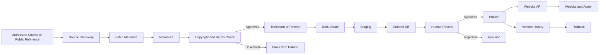
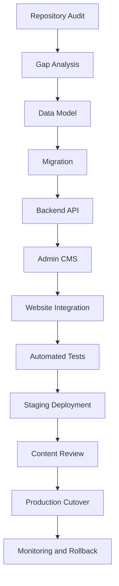
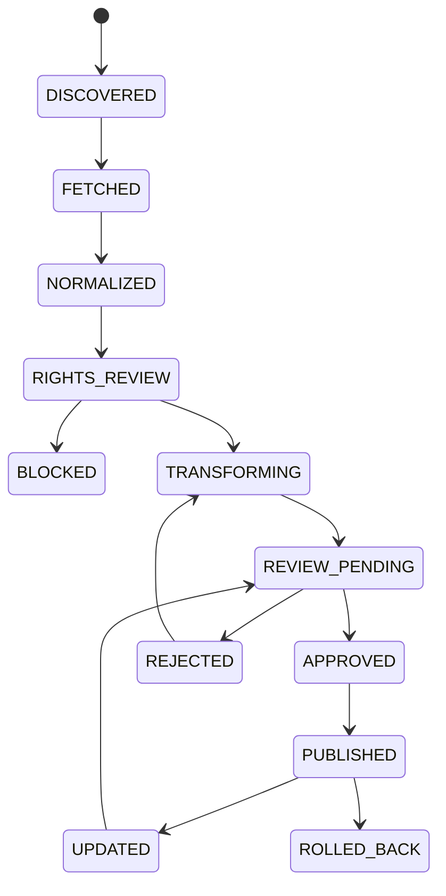

# Content sync workflow

**Mode in force:** `SAFE_REFERENCE_MODE` (default — no ownership evidence for JetVina content in repo).

## Overall flow

## Missing-module development

## Per-record state

## Rules (enforced in code)

1. First sync always `dryRun=true`.
2. SAFE mode stores **metadata only** (id, slug, title, URL, modified) — never marketing HTML.
3. Legal pages → `BLOCK` / `PROHIBITED` until legal review.
4. Media import off unless `EXTERNAL_MEDIA_IMPORT_ENABLED=true` **and** rights approved.
5. Publish requires `CONTENT_SYNC_PUBLISH_ENABLED=true` and all items APPROVED with publishable rights.
6. Never auto-delete target when source missing → `SOURCE_MISSING` + review.
7. Manual editor edits → conflict (do not overwrite).

## Feature flags

| Flag | Default prod |
|------|----------------|
| `CONTENT_SYNC_ENABLED` | on (manual) |
| `CONTENT_SYNC_PUBLISH_ENABLED` | **off** |
| `EXTERNAL_MEDIA_IMPORT_ENABLED` | **off** |
| `NEW_BRAND_CONTENT_ENABLED` | off until cutover |
| `JETBAY_CONTENT_CLEANUP_ENABLED` | on |
